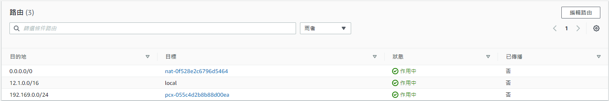

# Amazon EC2
## 執行個體生命週期

執行個體狀態 | 描述
----- | -----
pending | 執行個體準備進入 running 狀態。當執行個體初次啟動時，或者在處於 pending 狀態之後啟動時，將進入 stopped 狀態。
running | 執行個體正在執行中且可供使用。
stopping | 執行個體準備停止或停止休眠。
stopped | 執行個體已關閉且無法使用。執行個體可以隨時啟動。
shutting-down | 執行個體準備終止。
terminated | 執行個體已永久刪除且無法啟動。

## 手動建立 EC2
### 第一部分 : EC2
1. 選擇 "啟動新執行體" 並命名
2. 選擇 "作業系統映像"、"執行個體類型"、"金鑰對"
3. 網路設定，選擇 "VPC"，子網路設定 "public subnet"
4. 選擇 "安全群組(防火牆)"
5. 儲存空間設定
6. 啟動執行個體
### 第二部分 : 彈性 IP 
1. 選擇 "配置彈性 IP 地址"
2. 選擇 "與彈性 IP 地址建立關聯"
3. 選擇 "執行個體" & "私有 IP 地址"，建立關聯
### 第三部分 : EC2 連線
1. 用 SSH 連線 
    > (ex. `ssh ubuntu@ec2-35-79-113-14.ap-northeast-1.compute.amazonaws.com`)
### 第四部份 : 建立 VPC 對等連線
* VPC 對等連線是兩個 VPC 之間的聯網連線，可讓您私下路由兩者之間的流量
1. 選擇 "建立對等連線" 並命名
2. 選擇要與之建立對等連線的本機 VPC "自己的 EC2"
3. 選擇要與之建立對等連線的本機 VPC "VPN 的 VPC"
4. "建立對等連線"
5. 選擇動作 "接受請求"
### 第五部分 : 建立路由的對等連線
1. 將公司 VPN 和 EC2 互相連接，內部對內部，外部對外部
2. VPN 的 VPC 設定
* NAT-ROUTETABLE 

* ROUTETABLE 

3. EC2 的 VPC 設定
* NAT-ROUTETABLE 

* ROUTETABLE 

### 補充 : 手動建立 EC2 (Windows Server)
* 需要額外新增金鑰對並留存私有金鑰，以供連線時使用
