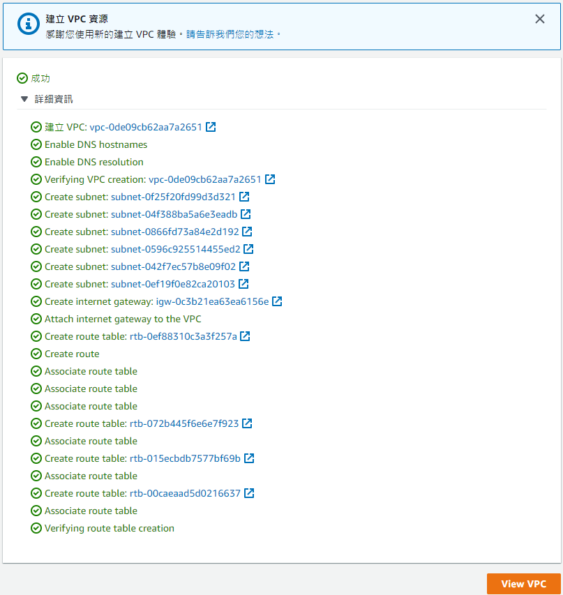
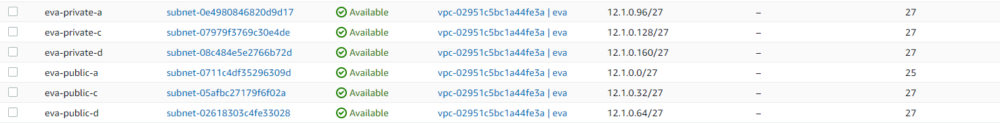
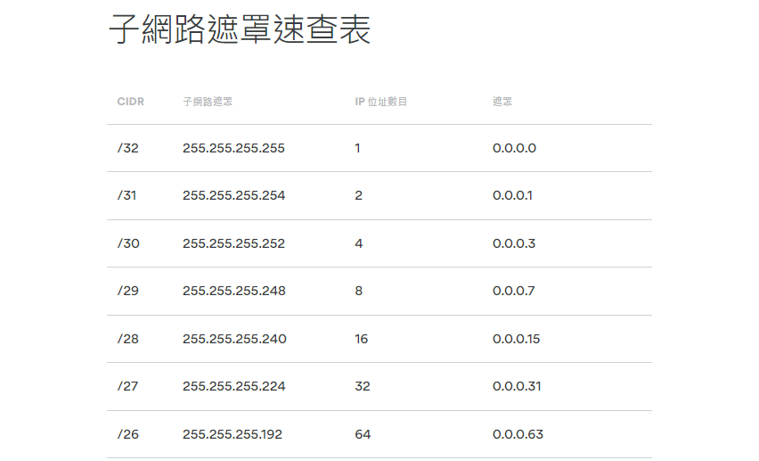
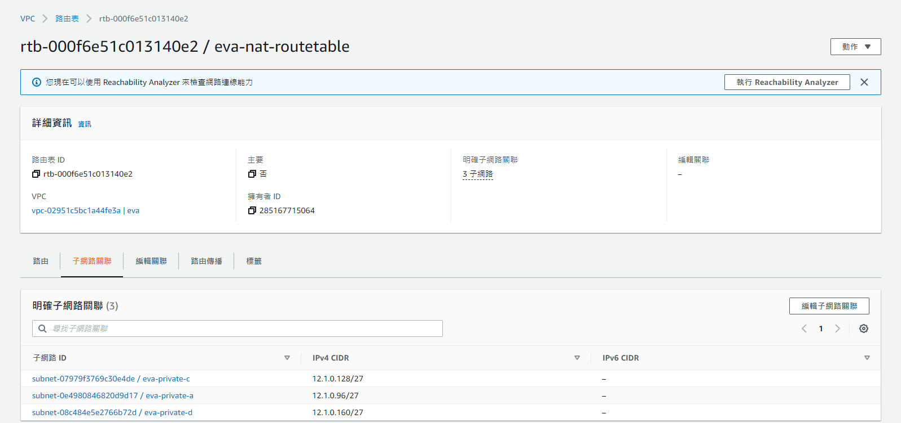
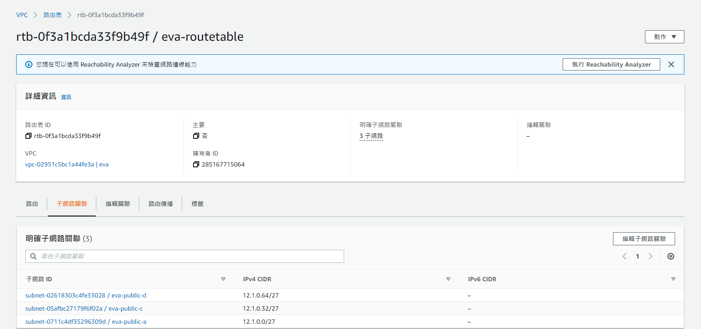
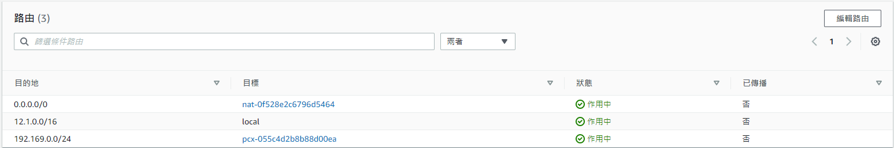
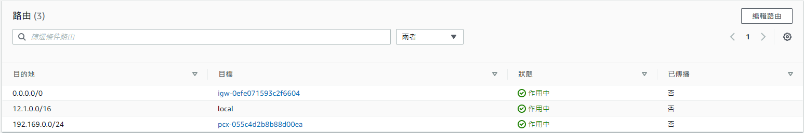
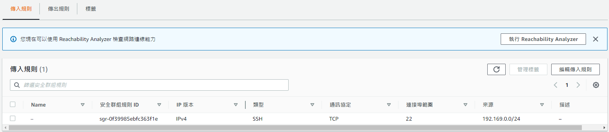

# Amazon VPC
* Amazon Virtual Private Cloud (Amazon VPC) 可讓您將 AWS 資源啟動到您定義的虛擬網路。這個虛擬網路與您在資料中心中操作的傳統網路非常相似，且具備使用 AWS 可擴展基礎設施的優勢。
### 步驟 1：了解預設 VPC
若您是初次使用 Amazon VPC，請使用以下步驟檢視預設 VPC 的組態，包括其預設子網、主路由表和網際網路閘道。所有預設子網均使用主路由表，其具有網際網路閘道路由。這意味著您啟動至預設子網的資源可存取網際網路。
檢視預設 VPC 的組態
1. 在 https://console.aws.amazon.com/vpc/ 開啟 Amazon VPC 主控台。
2. 在導覽窗格中，選擇 Your VPCs (您的 VPC)。對於預設 VPC，Default VPC (預設 VPC) 欄為 Yes (是)。如果您已建立其他 VPC，則 Default VPC (預設 VPC) 為 No (否)。
3. 每個 VPC 都有一個主路由表。預設子網使用主路由表，因其未與另一個路由表建立關聯。若要檢視主路由表，請選中預設 VPC 的核取方塊，然後選擇 Route table (路由表) 下的 ID。或者，從導覽窗格中選擇Route tables (路由表)，然後尋找路由表，其中 Main (主要) 欄為 Yes (是)，且 VPC 欄顯示 VPC 的 ID，後跟名稱、default (預設值)。
4. 在Routes (路由) 索引標籤上，有一個本機路由，允許 VPC 中的資源相互通訊，另一個路由則允許所有其他流量透過網際網路閘道連線網際網路。
5. 在導覽窗格中，選擇 Subnets (子網)。對於預設 VPC，每個可用區域均有一個子網。對於這些預設子網，Default subnet (預設子網) 欄為 Yes (是)。如果選取每個子網，您可以檢視其 CIDR 區塊、路由表的路由，以及預設網路 ACL 規則等資訊。
6. 在導覽窗格中，選擇 Internet gateways (網際網路閘道)。對於連接至預設 VPC 的網際網路閘道，VPC ID 欄顯示 VPC 的 ID，後跟名稱、default (預設值)。
### 步驟 2：在您的 VPC 中啟動執行個體

Amazon EC2 主控台針對您的執行個體組態提供預設值，這讓您能夠輕鬆且快速地開始使用。例如，在選擇 AWS 區域之後，我們會為該區域自動選擇預設 VPC。
在預設子網中啟動執行個體
1. 在 https://console.aws.amazon.com/ec2/ 開啟 Amazon EC2 主控台。
2. 在儀表板中，選擇啟動執行個體。
3. 在螢幕上方的導覽列中，選取要啟動執行個體的「區域」。
4. (選用) 在 Name and tags (名稱和標籤) 下，輸入執行個體的描述性名稱。
5. 在 Application and OS Images (Amazon Machine Image) (應用程式和作業系統映像 (Amazon Machine Image)) 下，選擇 Quick Start (快速入門)，然後選擇執行個體的作業系統。
6. 在 Instance type (執行個體類型) 下，保留預設值 t2.micro，這符合免費方案資格。
7. 在 Key pair (login) (金鑰對 (登入)) 下，選擇現有的金鑰對，建立新的金鑰對，或者如果您不打算連線至您在本練習中建立的新執行個體，則選擇 Proceed without a key pair (在沒有金鑰對的情況下繼續)。
8. 在 Network settings (網路設定) 下，請注意，我們已為您選取的區域選取了預設 VPC，我們將為您選取預設子網，然後為您的執行個體指派一個公有 IP 地址。您可以保留這些設定。我們還會建立預設安全群組，其規則允許 SSH 流量 (Linux 執行個體) 或 RDP 流量 (Windows 執行個體) 從任何位置傳輸至您的執行個體。

    * 如果您正在啟動測試執行個體，並計劃在完成本練習後停止或終止該執行個體，則允許 SSH 或 RDP 流量從任何位置傳輸至執行個體的規則是可接受的。在生產環境中，您應僅授權 SSH 或 RDP 流量的特定地址範圍。
    
9. 在 Summary (摘要) 面板中，選擇 Launch instance (啟動執行個體)。

### 步驟 3：連線至公有子網中的 EC2 執行個體
您的預設公有子網中的 EC2 執行個體可從網際網路存取。您可以從家用網路，使用 SSH 或遠端桌面以連線至執行個體。
* 如需如何連線至公有子網中 Linux 執行個體的詳細資訊，請參閱《適用於 Linux 執行個體的 Amazon EC2 使用者指南》中的連線至您的 Linux 執行個體。
* 如需如何連線至公有子網中 Windows 執行個體的詳細資訊，請參閱《適用於 Windows 執行個體的 Amazon EC2 使用者指南》中的連線至 Windows 執行個體。
### 步驟 4：清理
完成後，您可以終止該執行個體。執行個體狀態變更時刻起，該執行個體便會停止收取任何費用。在執行個體終止後，它仍會短暫顯示於主控台。
請勿刪除預設 VPC。
欲使用主控台來終止執行個體
1. 在 https://console.aws.amazon.com/ec2/ 開啟 Amazon EC2 主控台。
2. 在導覽窗格中，選擇 Instances (執行個體)。
3. 選取執行個體，並選擇 Instance state (執行個體狀態)、Terminate instance (終止執行個體)。
4. 出現確認提示時，請選擇終止。

## 手動建立 VPC
### 第一部分 : VPC
1. 選擇 "僅限VPC" ，設定IPv4， "建立VPC"
2. 建立 "DNS主機名稱"
3. 建立 "DNS解析"
### 第二部分 : 子網路
1. 選擇 "建立子網路"
2. 選取 "VPC ID"
3. 子網路設定，設定三個 private subnet，三個 public subnet
4. 切割網段

* 切割子網路補充 :  

### 第三部分 : 網際網路閘道
1. 選擇 "建立網際網路閘道" 並命名
2. 選擇動作 "連線至VPC"
### 第四部份 : 路由表
1. 選擇 "建立路由表"，建立 NAT-ROUTETABLE 和 ROUTETABLE 共兩個
2. 選取對應此路由的 VPC
3. "建立路由表"
4. 編輯 "子網路關聯"，分別加入 subnet
* NAT-ROUTETABLE 加入 private subnet

* ROUTETABLE 加入 public subnet

### 第五部分 : NAT 閘道
1. 選擇 "建立 NAT 閘道" 並命名
2. 選取 "子網路"，選擇 public subnet
3. "配置彈性IP"
4. "建立 NAT 閘道"
### 第六部分 : 路由表設定
1. NAT-ROUTETABLE - 路由加入 NAT

2. ROUTETABLE - 路由加入 IGW

### 第七部分 : 安全群組
1. "編輯傳入規則" 並新增規則
2. 加入 VPN 的 IPv4 網域 (ex. 192.169.0.0/24)，只開放內網連線，所以不需要設定 0.0.0.0

* [開始使用 Amazon VPC](https://docs.aws.amazon.com/zh_tw/vpc/latest/userguide/vpc-getting-started.html)

* [使用子網路](https://docs.aws.amazon.com/zh_tw/vpc/latest/userguide/working-with-subnets.html)

* [區域 (Region) 和區域 (Zone)](https://docs.aws.amazon.com/zh_tw/AWSEC2/latest/UserGuide/using-regions-availability-zones.html?icmpid=docs_ec2_console#concepts-regions-availability-zones)