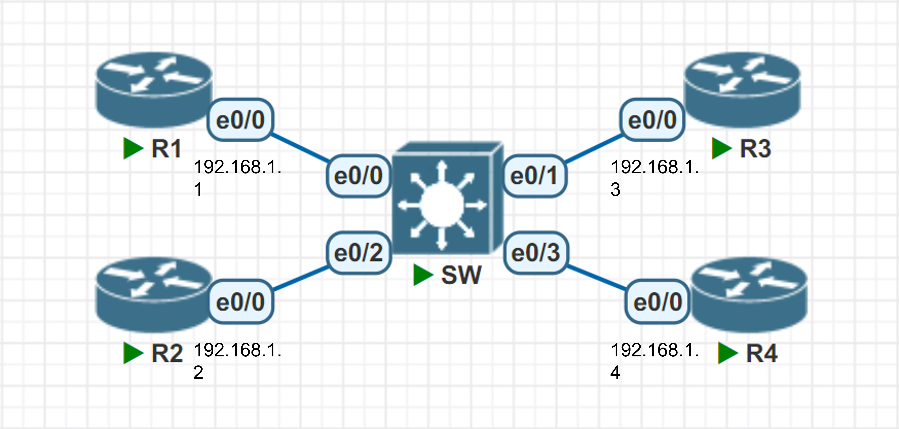
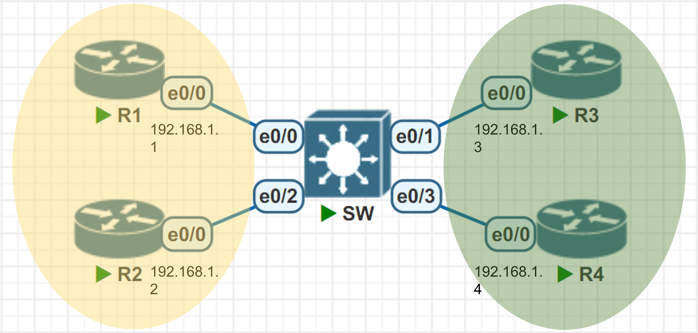
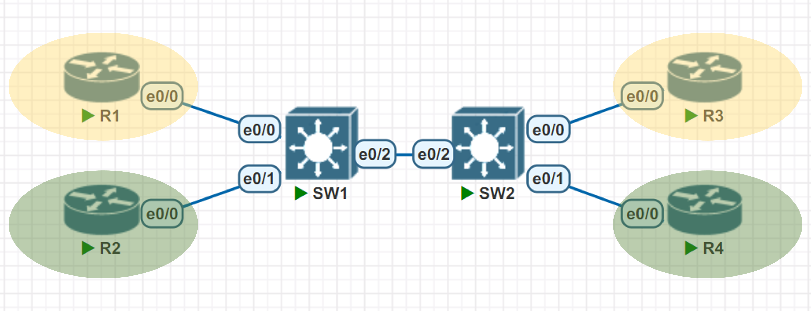

# 📝 VLAN 
## 📖 基礎設定

* R1
```
Router(config) # hostname R1
R1(config) # int e0/0
R1(config-if) # ip addr 192.168.1.1 255.255.255.0  
R1(config-if) # no shutdown
R1 # show ip int brief
    Interface              IP-Address      OK? Method Status            
        Protocol
    Ethernet0/0            192.168.1.1     YES manual administratively d
    own down    
    Ethernet0/1            unassigned      YES unset  administratively d
    own down    
    Ethernet0/2            unassigned      YES unset  administratively d
    own down    
    Ethernet0/
```
* R2
```
Router(config) # hostname R2
R2(config) # int e0/0
R2(config-if) # ip addr 192.168.1.2 255.255.255.0  
R2(config-if) # no shutdown
R2 # show ip int brief
    Interface              IP-Address      OK? Method Status            
        Protocol
    Ethernet0/0            192.168.1.1     YES manual administratively d
    own down    
    Ethernet0/1            unassigned      YES unset  administratively d
    own down    
    Ethernet0/2            unassigned      YES unset  administratively d
    own down    
    Ethernet0/
```
* R3
```
Router(config) # hostname R3
R3(config) # int e0/0
R3(config-if) # ip addr 192.168.1.3 255.255.255.0  
R3(config-if) # no shutdown
R3 # show ip int brief
    Interface              IP-Address      OK? Method Status            
        Protocol
    Ethernet0/0            192.168.1.1     YES manual administratively d
    own down    
    Ethernet0/1            unassigned      YES unset  administratively d
    own down    
    Ethernet0/2            unassigned      YES unset  administratively d
    own down    
    Ethernet0/
```
* R4
```
Router(config) # hostname R4
R4(config) # int e0/0
R4(config-if) # ip addr 192.168.1.4 255.255.255.0  
R4(config-if) # no shutdown
R4 # show ip int brief
    Interface              IP-Address      OK? Method Status            
        Protocol
    Ethernet0/0            192.168.1.1     YES manual administratively d
    own down    
    Ethernet0/1            unassigned      YES unset  administratively d
    own down    
    Ethernet0/2            unassigned      YES unset  administratively d
    own down    
    Ethernet0/
```
* 成果 - 可以互 ping
```
R1 # ping 192.168.1.2
    Type escape sequence to abort.
    Sending 5, 100-byte ICMP Echos to 192.168.1.2, timeout is 2 second
    s:
    !!!!!
    Success rate is 100 percent (5/5), round-trip min/avg/max = 1/1/1 
    ms
R2 # ping 192.168.1.3
    Type escape sequence to abort.
    Sending 5, 100-byte ICMP Echos to 192.168.1.3, timeout is 2 second
    s:
    !!!!!
    Success rate is 100 percent (5/5), round-trip min/avg/max = 1/1/1 
    ms
```
## 🔖 SWITCH 切割 VLAN

* vlan 創建命名
```
Switch(config) # vlan 10
Switch(config-vlan) # name yellow
Switch(config-vlan) # vlan 20
Switch(config-vlan) # name green
Switch#show vlan

    VLAN Name                             Status    Ports
    ---- -------------------------------- --------- -------------------------------
    1    default                          active    Et0/0, Et0/1, Et0/2, Et0/3
    10   yellow                           active    
    20   green                            active    
    1002 fddi-default                     act/unsup 
    1003 token-ring-default               act/unsup 
    1004 fddinet-default                  act/unsup 
    1005 trnet-default                    act/unsup 

    VLAN Type  SAID       MTU   Parent RingNo BridgeNo Stp  BrdgMode Trans1 Trans2
    ---- ----- ---------- ----- ------ ------ -------- ---- -------- ------ ------
    1    enet  100001     1500  -      -      -        -    -        0      0   
    10   enet  100010     1500  -      -      -        -    -        0      0   
    20   enet  100020     1500  -      -      -        -    -        0      0   
    1002 fddi  101002     1500  -      -      -        -    -        0      0   
    1003 tr    101003     1500  -      -      -        -    -        0      0   
    1004 fdnet 101004     1500  -      -      -        ieee -        0      0   
    1005 trnet 101005     1500  -      -      -        ibm  -        0      0
```
* 將 Router 放入 switchport
```
Switch(config) # int e0/0
Switch(config-if) # switchport access vlan 10
Switch(config-if) # int e0/2
Switch(config-if) # switchport access vlan 10
Switch(config-if) # int e0/1
Switch(config-if) # switchport access vlan 20
Switch(config-if) # int e0/3
Switch(config-if) # switchport access vlan 20
```
* 成果 - 不同 switchport 不可互 ping
```
R1 # ping 192.168.1.2
    Type escape sequence to abort.
    Sending 5, 100-byte ICMP Echos to 192.168.1.2, timeout is 2 seconds:
    !!!!!
    Success rate is 100 percent (5/5), round-trip min/avg/max = 1/1/2 ms
R1 # ping 192.168.1.3
    Type escape sequence to abort.
    Sending 5, 100-byte ICMP Echos to 192.168.1.3, timeout is 2 seconds:
..
```

```
Switch#show vlan

    VLAN Name                             Status    Ports
    ---- -------------------------------- --------- -------------------------------
    1    default                          active    
    10   yellow                           active    Et0/0, Et0/2
    20   green                            active    Et0/1, Et0/3
    1002 fddi-default                     act/unsup 
    1003 token-ring-default               act/unsup 
    1004 fddinet-default                  act/unsup 
    1005 trnet-default                    act/unsup 

    VLAN Type  SAID       MTU   Parent RingNo BridgeNo Stp  BrdgMode Trans1 Trans2
    ---- ----- ---------- ----- ------ ------ -------- ---- -------- ------ ------
    1    enet  100001     1500  -      -      -        -    -        0      0   
    10   enet  100010     1500  -      -      -        -    -        0      0   
    20   enet  100020     1500  -      -      -        -    -        0      0   
    1002 fddi  101002     1500  -      -      -        -    -        0      0   
    1003 tr    101003     1500  -      -      -        -    -        0      0   
    1004 fdnet 101004     1500  -      -      -        ieee -        0      0   
    1005 trnet 101005     1500  -      -      -        ibm  -        0      0   
```
## 🔖 TRUNK LINK

* SW1 vlan 設定
```
SW1 # show vlan

    VLAN Name                             Status    Ports
    ---- -------------------------------- --------- -------------------------------
    1    default                          active    Et0/3
    10   yellow                           active    Et0/0
    20   green                            active    Et0/1
    1002 fddi-default                     act/unsup 
    1003 token-ring-default               act/unsup 
    1004 fddinet-default                  act/unsup 
    1005 trnet-default                    act/unsup 

    VLAN Type  SAID       MTU   Parent RingNo BridgeNo Stp  BrdgMode Trans1 Trans2
    ---- ----- ---------- ----- ------ ------ -------- ---- -------- ------ ------
    1    enet  100001     1500  -      -      -        -    -        0      0   
    10   enet  100010     1500  -      -      -        -    -        0      0   
    20   enet  100020     1500  -      -      -        -    -        0      0   
    1002 fddi  101002     1500  -      -      -        -    -        0      0   
    1003 tr    101003     1500  -      -      -        -    -        0      0   
    1004 fdnet 101004     1500  -      -      -        ieee -        0      0   
    1005 trnet 101005     1500  -      -      -        ibm  -        0      0   
```
* SW2 vlan 設定
```
SW2 # show vlan

    VLAN Name                             Status    Ports
    ---- -------------------------------- --------- -------------------------------
    1    default                          active    Et0/3
    10   yellow                           active    Et0/0
    20   green                            active    Et0/1
    1002 fddi-default                     act/unsup 
    1003 token-ring-default               act/unsup 
    1004 fddinet-default                  act/unsup 
    1005 trnet-default                    act/unsup 

    VLAN Type  SAID       MTU   Parent RingNo BridgeNo Stp  BrdgMode Trans1 Trans2
    ---- ----- ---------- ----- ------ ------ -------- ---- -------- ------ ------
    1    enet  100001     1500  -      -      -        -    -        0      0   
    10   enet  100010     1500  -      -      -        -    -        0      0   
    20   enet  100020     1500  -      -      -        -    -        0      0   
    1002 fddi  101002     1500  -      -      -        -    -        0      0   
    1003 tr    101003     1500  -      -      -        -    -        0      0   
    1004 fdnet 101004     1500  -      -      -        ieee -        0      0   
    1005 trnet 101005     1500  -      -      -        ibm  -        0      0   
```
* 將 Switch 的 Interface 設定成 802.1q Trunk
```
SW1(config) # int e0/2
SW1(config-if) # switchport trunk encapsulation dot1q
SW1(config-if) # switchport mode trunk
SW1 # show int trunk

    Port        Mode             Encapsulation  Status        Native vlan
    Et0/2       on               802.1q         trunking      1

    Port        Vlans allowed on trunk
    Et0/2       1-4094

    Port        Vlans allowed and active in management domain
    Et0/2       1,10,20

    Port        Vlans in spanning tree forwarding state and not pruned
    Et0/2       1,10,20
```
```
SW2(config) # int e0/2
SW2(config-if) # switchport trunk encapsulation dot1q
SW2(config-if) # switchport mode trunk
SW2 # show int trunk

    Port        Mode             Encapsulation  Status        Native vlan
    Et0/2       on               802.1q         trunking      1

    Port        Vlans allowed on trunk
    Et0/2       1-4094

    Port        Vlans allowed and active in management domain
    Et0/2       1,10,20

    Port        Vlans in spanning tree forwarding state and not pruned
    Et0/2       1,10,20
```
* R1 可以 ping R3 ，卻無法與其他溝通
```
R1 # ping 192.168.1.3
    Type escape sequence to abort.
    Sending 5, 100-byte ICMP Echos to 192.168.1.3, timeout is 2 seconds:
    .!!!!
    Success rate is 80 percent (4/5), round-trip min/avg/max = 1/1/2 ms
R1 # ping 192.168.1.2
    Type escape sequence to abort.
    Sending 5, 100-byte ICMP Echos to 192.168.1.2, timeout is 2 seconds:
    .....
    Success rate is 0 percent (0/5)
R1 # ping 192.168.1.4
    Type escape sequence to abort.
    Sending 5, 100-byte ICMP Echos to 192.168.1.4, timeout is 2 seconds:
    .....
    Success rate is 0 percent (0/5)
```
## 🔖 ALLOWED VLAN
```
SW1(config-if) # switchport trunk allowed vlan 10,20,30
SW1 # show int trunk

    Port        Mode             Encapsulation  Status        Native vlan
    Et0/2       on               802.1q         trunking      1

    Port        Vlans allowed on trunk
    Et0/2       10,20,30

    Port        Vlans allowed and active in management domain
    Et0/2       10,20

    Port        Vlans in spanning tree forwarding state and not pruned
    Et0/2       10,20
```
#### 👉 show int trunk 資料
* `Vlans allowed on trunk` : 這條 trunk 允許通過的 vlan
* `Vlans allowed and active in management domain` : 在這個 Switch 上只存在 VLAN 10、20，所以實際上 VLAN 30 過不了
* `Vlans in spanning tree forwarding state and not pruned` : 真正可以通過的 VLAN ，即 VLAN 10、20
* `witchport trunk allowed vlan ?` : 
    ```
    SW1(config-if) # switchport trunk allowed vlan ?       
        WORD    VLAN IDs of the allowed VLANs when this port is in trunking mode
        add     add VLANs to the current list
        all     all VLANs
        except  all VLANs except the following
        none    no VLANs
        remove  remove VLANs from the current list
    ```
    * `add` : 保留原設定外在額外增加 VLAN
        * 原設定 : 1-100
        * 指令 : `switchport trunk allowed vlan add 100-200`
        * 新設定 : 1-200
    * `all` : 允許全部 VLAN 通過
        * 原設定 : 1-100
        * 指令 : `switchport trunk allowed vlan all`
        * 新設定 : 1-4094
    * `except` : 允許除了特定 VLAN 外的全部 VLAN (1-4094) 通過
        * 原設定 : 1-100
        * 指令 : `switchport trunk allowed vlan except 100-200`
        * 新設定 : 1-99、201-4094
    * `none` : 不允許任何 VLAN 通過
        * 原設定 : 1-100
        * 指令 : `switchport trunk allowed vlan none`
        * 新設定 : none
    * `remove` : 保留原 Allowed VLAN 設定，再移除特定 VLAN
        * 原設定 : 1-100
        * 指令 : `switchport trunk allowed vlan remove 20-30`
        * 新設定 : 1-19、31-100
    > 補充 : VLAN <br>
    > IEEE 802.1Q 中的 VLAN 僅使用 12 位 <br>
    > 因此只能使用 0-4095 的 VLAN（2^12 = 4096 不同的 VLAN）<br>
    > 其實少了2個，0和4095是保留的，所以能使用的為1-4094

### 👉 VLAN 1
* VLAN 1 是一個預設的 VLAN，大部分 Switch 都有 VLAN 1，而所有 port 預設在 VLAN 1 中
* VLAN 1 和其他 VLAN 一樣可以傳送 data 之外，還負責傳送所謂 Control Plane Traffic (網路層)，例如: VTP, CDP, PAgP 等
* VLAN 1 應避免給一般 HOST 使用，因為 HOST 利用 Packet Capture 軟體可以輕易 Capture 到 Control Plane 的重要信息

### 👉 NATIVE VLAN
* VLAN 1 預設也是 Trunk Link 上的一個 Native VLAN
* Switch 把這個 VLAN 的 Packet 送上 Trunk Link 時，是不會放入 VLAN Tag 的，只要 Trunk Link 兩邊的 Switch 都協議沒有 VLAN ID 的 Packet 就是 VLAN 1，那麽 VLAN 1 就算沒有 VLAN ID 也可以被區別出來

### 👉 VLAN INTERNAL USAGE
```
SW1 # show vlan int usa

    VLAN Usage
    ---- --------------------
```
* 把 port 設定成 Layer 3 Port (1006 為預設)
```
SW1 # show vlan int usa

    VLAN Usage
    ---- --------------------
    1006 Ethernet0/1
```

## 📖 補充資料
* [IEEE 802.1Q](https://en.wikipedia.org/wiki/IEEE_802.1Q#Frame_format)


🖊️ editor : yi-chien Liu