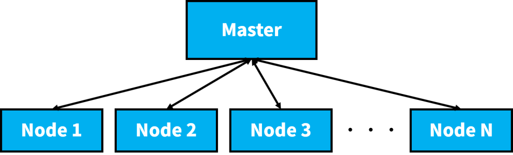
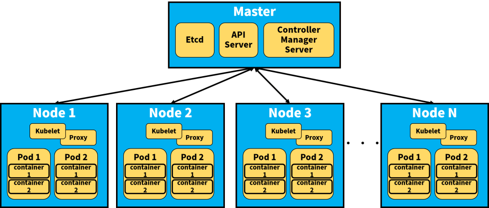
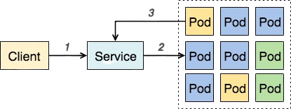

# 📝 Kubernetes
* 精良的容器編排管理工具
* Google Container Engine (GKE) 裡面使用 Kuberenetes

## 🔖 傳統單體架構的服務會造成的不便 :
1. 龐大且複雜的程式碼 - 除錯、新增功能與測試都包在一起，變得十分複雜
2. 容易以低效率的開發方式進行 – 利用新語言和新框架將更為困難，因為搬移或更動將耗費巨大成本
3. 不利於敏捷開發 – 現今的服務幾乎是每天更新，單體架構會讓這件事變得很耗時間
4. 可靠性低 – 單體架構是將所有的模組均建構在一個 process 內，當其中一環有 bug 時，容易牽一髮動全身

## 🔖 K8S 屬分布式系統，主要元件有：

1. Master – 可做為主節點
2. Node – 主要工作的節點，上面運行了許多容器。可想作一台虛擬機。
    > (K8S 可操控高達 1,000 個 nodes 以上)
3. masters 和 nodes 組成叢集 (Clusters)

## 🔖 K8S 三大重點 :
* Pod
* Service
* Deployments (Replication Controller)
### 👉 Pod
* 容器是位於 pod 內部，一個 pod 包覆著一個以上的容器，這造成 K8S 與一般容器不同的操作概念
* 在 Docker 裡， Docker container 是最小單位，但在 K8S 可想作 pod 為最小單位
    1. Pod 擁有不確定的生命週期，所以不曉得任一 pod 是否會永久保留
    2. Pod 內有一個讓所有 container 共用的 Volume，這會與 Docker 不同
    3. Pod 採取 shared IP，內部所有的容器皆使用同一個 Pod IP，這與 Docker 不同
    4. Pod 內的眾多容器都會和 Pod 同生共死
### 👉 Service
* K8S 的 Service 有它的獨特方法 :

    1. 每個 Service 包含著一個以上的 pod
    2. 每個 Service 有個獨立且固定的 IP 地址 – Cluster IP
    3. 客戶端訪問 Service 時，會經由上述提過的 proxy 來達到負載平衡、與各 pod 連結的結果
    4. 利用標籤選擇器 (Label Selector)，聰明地選擇那些已貼上標籤的 pod
### 👉 Deployments
* Deployments 顧名思義掌控了部署 Kubernetes 服務的一切。它主要掌管了 Replica Set 的個數，而 Replica Set 的組成就是一個以上的 Pod
    1. Deployments 的設定檔，可以指定 replica，並保證在該 replica 的數量運作
    2. Deployments 會檢查 pod 的狀態
    3. Deployments 下可執行滾動更新或者回滾

# 📖 
## 🔖 
### 👉 
#### 📍 
## 📖 補充資料

🖊️ editor : yi-chien Liu

