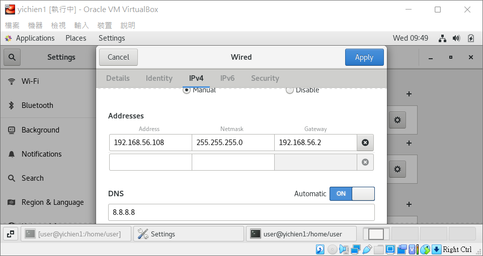
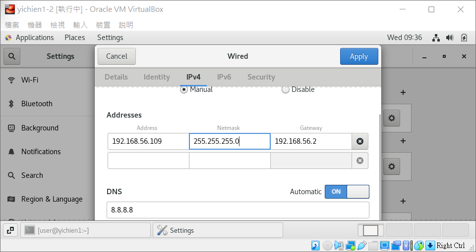
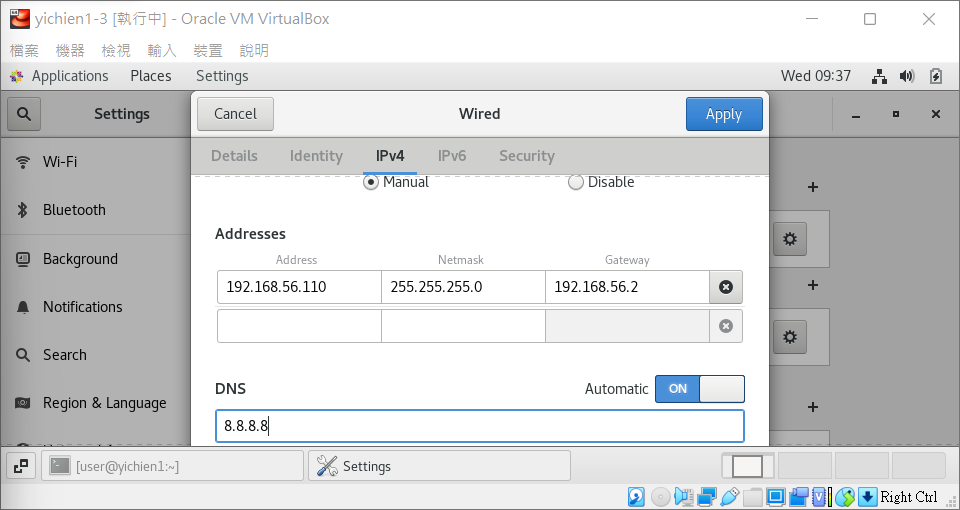
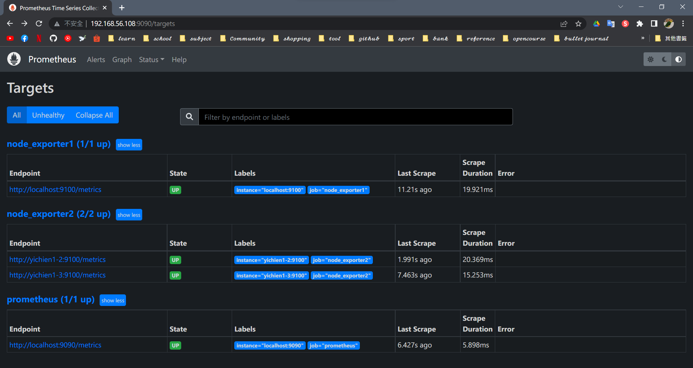

# 📝 Linux系統自動化運維第十週筆記20220427
# 📖 PROMETHEUS
## 🔖 設定
### 👉 第一步 : 修改虛擬機名稱
* each machine needs to have 2 core CPU and 2GB memory.
```
01 # hostnamectl set-hostname yichien1-1
02 # hostnamectl set-hostname yichien1-1
03 # hostnamectl set-hostname yichien1-1
```
### 👉 第二步 : 手動設定 IPv4
* 第一台 (192.168.56.108)

* 第二台 (192.168.56.109)

* 第三台 (192.168.56.110)

### 👉 第三步 : 重新開啟網路
### 👉 第四步 : 編輯 hosts 設定檔 (三台都要)
```
04 # gedit /etc/hosts
    127.0.0.1   localhost localhost.localdomain localhost4 localhost4.localdomain4
    ::1         localhost localhost.localdomain localhost6 localhost6.localdomain6

    192.168.56.108 yichien1-1
    192.168.56.109 yichien1-2
    192.168.56.110 yichien1-3
```
## 🔖 安裝
### 👉 提前創建用戶
```
05 # groupadd prometheus
06 # useradd -g prometheus -m -d /var/lib/prometheus -s /sbin/nologin prometheus
```
### 👉 PROMETHEUS - PROMETHEUS SERVER
```
07 # cd /home/user/Downloads
08 # wget https://github.com/prometheus/prometheus/releases/download/v2.35.0/prometheus-2.35.0.linux-amd64.tar.gz
    --2022-04-27 11:27:46--  https://github.com/prometheus/prometheus/releases/download/v2.35.0/prometheus-2.35.0.linux-amd64.tar.gz
    Resolving github.com (github.com)... 52.69.186.44
    Connecting to github.com (github.com)|52.69.186.44|:443... connected.
09 # mkdir /opt/module
10 # tar xf prometheus-2.35.0.linux-amd64.tar.gz -C /opt/module
11 # chown -R prometheus.prometheus /opt/module/prometheus-2.35.0.linux-amd64
12 # cd /opt/module
13 # mv prometheus-2.35.0.linux-amd64/ prometheus
14 # gedit /usr/lib/systemd/system/prometheus.service
    [Unit]
    Description=Prometheus
    After=network-online.target

    [Service]
    Type=simple
    Restart=on-failure
    ExecStart=/opt/module/prometheus/prometheus --config.file=/opt/module/prometheus/prometheus.yml --storage.tsdb.path=/opt/module/prometheus/data --storage.tsdb.retention=30d --web.enable-lifecycle --log.level=debug

    [Install]
    WantedBy=multi-user.targe
15 # systemctl daemon-reload
16 # systemctl start prometheus.service
```
### 👉 NODE_EXPORTER - PROMETHEUS SERVER + PROMETHEUS CLIENT
```
17 # cd /home/user/Downloads
18 # wget https://github.com/prometheus/node_exporter/releases/download/v1.3.1/node_exporter-1.3.1.linux-amd64.tar.gz
    --2022-04-27 11:44:25--  https://github.com/prometheus/node_exporter/releases/download/v1.3.1/node_exporter-1.3.1.linux-amd64.tar.gz
    Resolving github.com (github.com)... 52.69.186.44
    Connecting to github.com (github.com)|52.69.186.44|:443... connected.
19 # mkdir /opt/module
20 # tar xf node_exporter-1.3.1.linux-amd64.tar.gz -C /opt/module
21 # chown -R prometheus.prometheus /opt/module/node_exporter-1.3.1.linux-amd64
22 # cd /opt/module
23 # mv node_exporter-1.3.1.linux-amd64/ node_exporter
24 # gedit /usr/lib/systemd/system/node_exporter.service
    [Unit]
    Description=node_exporter
    Documentation=https://github.com/prometheus/node_exporter
    After=network.target
    
    [Service]
    Type=simple
    ExecStart=/opt/module/node_exporter/node_exporter
    Restart=on-failure

    [Install]
    WantedBy=multi-user.target
25 # systemctl daemon-reload
26 # systemctl start node_exporter.service
```
* PROMETHEUS 連線

### 👉 PROMETHEUS SERVER - 監控任務設定
```
27 # gedit /opt/module/prometheus/prometheus.yml 
    static_configs:
      - targets: ["localhost:9090"]

  - job_name: "node_exporter1"
    static_configs:
      - targets: ["localhost:9100"]

  - job_name: "node_exporter2"
    static_configs:
      - targets: ["yichien1-2:9100","yichien1-3:9100"]
28 # systemctl daemon-reload
29 # systemctl restart prometheus.service
```
* NODE-EXPORTER 連線

## 📖 補充資料
* [PROMETHEUS 安裝檔](https://prometheus.io/download/)
* [Prometheus 學習配置](https://www.codeleading.com/article/10525895320/)
* [圖文詳解Prometheus監控+Grafana+Alertmanager告警安裝使用](https://codingnote.cc/zh-tw/p/150392/)
* [集縮比](https://zh.wikipedia.org/wiki/%E9%9B%86%E7%B8%AE%E6%AF%94)
* [PT - Penetration test](https://zh.wikipedia.org/wiki/%E6%B8%97%E9%80%8F%E6%B5%8B%E8%AF%95)
* [HA - high availability 高可用性](https://zh.wikipedia.org/wiki/%E9%AB%98%E5%8F%AF%E7%94%A8%E6%80%A7)
* [STP -Spanning Tree Protocol 生成樹協定](https://zh.wikipedia.org/wiki/%E7%94%9F%E6%88%90%E6%A0%91%E5%8D%8F%E8%AE%AE)
* [交換機堆疊](https://www.796t.com/content/1550147965.html)


🖊️ editor : yi-chien Liu


