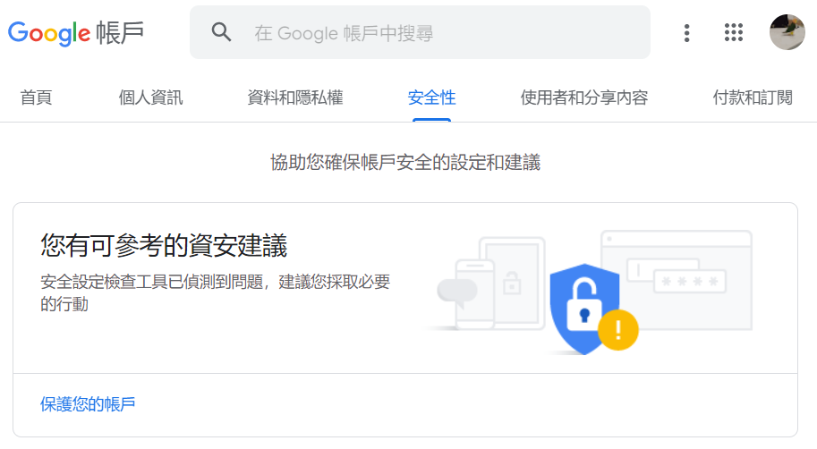
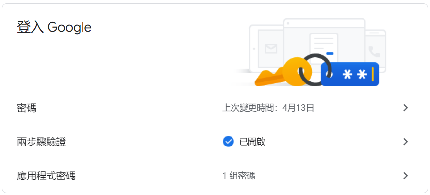
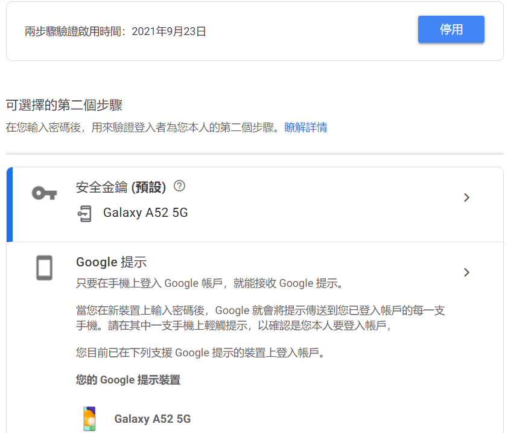
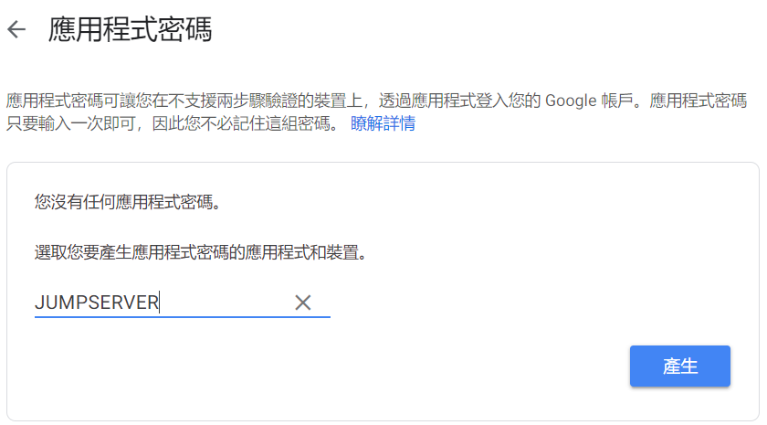
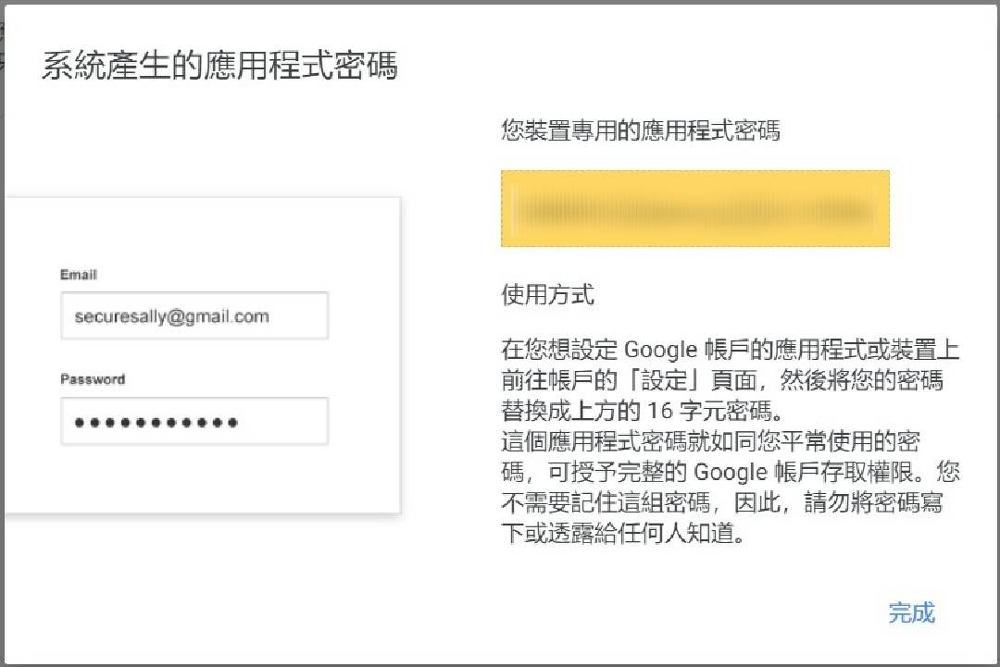
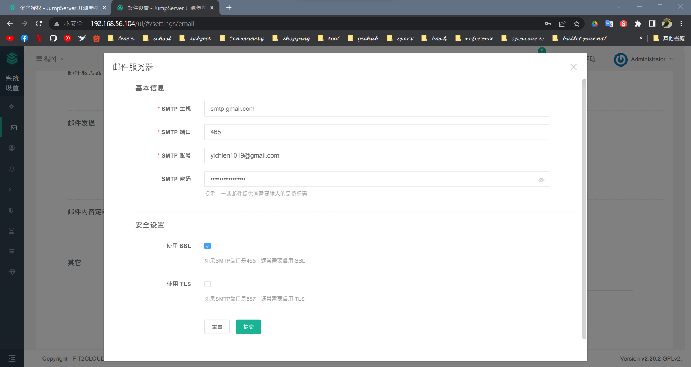
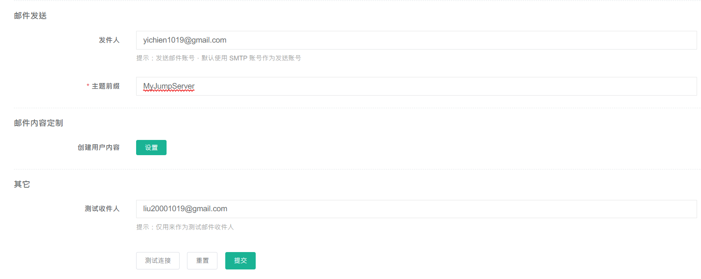

# 📝 Linux系統自動化運維第九週筆記20220413
# 📖 JUMPSERVER + Google SMTP寄信
## 🔖 GMAIL 設定
### 👉 第一步：進入 Google 安全設定頁面 

### 👉 第二步：啟用「兩步驟驗證」 


### 👉 第三步：設定「應用程式密碼」 

* 取得密碼

### 👉 第四步：設定Google SMTP寄信 
```
SMTP主機：smtp.gmail.com
SMTP 埠號：465
SMTP 安全模式：SSL/TLS
SMTP 認證：是
SMTP 帳號：[你的gmail帳號]
SMTP 密碼：[google應用程式密碼]
```
## 🔖 JUMPSERVER 設定
### 👉 部署
* 郵件服務器

* 郵件發送測試

### 👉 測試結果
* EMAIL


## 📖 補充資料
* [如何使用Google SMTP寄信(兩段式驗證+應用程式密碼) - 主機架站寄信教學](https://www.webdesigntooler.com/google-smtp-send-mail)


🖊️ editor : yi-chien Liu