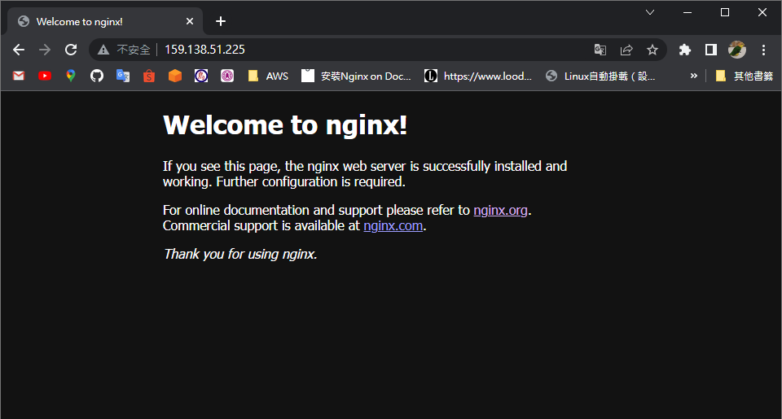

# NGINX
## 安裝
### 設定 `.repo` 檔
* Repo是由Android開發的命令行工具，對Git部分命令進行了封裝，將多個Git庫有效的進行組織
```
01 # vim /etc/yum.repos.d/nginx.repo
    [nginx-stable]
    name=nginx stable repo
    baseurl=http://nginx.org/packages/centos/$releasever/$basearch/
    gpgkey=https://nginx.org/keys/nginx_signing.key
    gpgcheck=1
    enabled=1
```
### yum 安裝
```
02 # yum install nginx
```
### 連線 


## 設定檔
### 設定檔主檔 `/etc/nginx/nginx.conf`
```
# Nginx 的啟用的 Linux 帳戶
user  nginx;

# Nginx 的執行緒數量
worker_processes  auto;

# Error Log 檔的位置
error_log  /var/log/nginx/error.log notice;
pid        /var/run/nginx.pid;

events {
    # 允許同一時間連線總數量
    worker_connections  1024;
}

# http 區塊，負責處理透過http協定的連結
http {
    include       /etc/nginx/mime.types;
    default_type  application/octet-stream;

    # 預設的 log 記錄格式
    log_format  main  '$remote_addr - $remote_user [$time_local] "$request" '
                      '$status $body_bytes_sent "$http_referer" '
                      '"$http_user_agent" "$http_x_forwarded_for"';

    # Access log 檔的位置
    access_log  /var/log/nginx/access.log  main;

    sendfile        on;
    #tcp_nopush     on;

    keepalive_timeout  65;

    # 預設不會自動啟動 gzip 壓縮
    #gzip  on;

    # 載入 /etc/nginx/conf.d/ 下的所有設定檔
    include /etc/nginx/conf.d/*.conf;
}
```
#### `log_format`格式

| 引數                    | 說明                                        | 示例|
|----------------------- | ------------------------------------------- | -----------------------------------------
|$remote_addr            | 客戶端地址                                   | 192.168.122.1
|$remote_user            | 客戶端使用者名稱                             |   --
|$time_local             | 訪問時間和時區                               | 17/Dec/2018:10:47:58 +0800
|$request                | 請求的URI和HTTP協議                          | "GET / HTTP/1.1"
|$status                 | HTTP請求狀態                                 | 304
|$upstream_status        | upstream狀態                                | 0
|$body_bytes_sent        | 傳送給客戶端檔案內容大小                      | -
|$http_referer           | url跳轉來源,用於記錄是從哪個頁面連結訪問過來的  |                                 
|$http_user_agent        | 使用者終端瀏覽器等資訊,即客戶瀏覽器的相關資訊   | "Mozilla/5.0 (X11; Linux x86_64; rv:52.0) Gecko/20100101 Firefox/52.0"
|$http_host              | 請求地址，即瀏覽器中你輸入的地址（IP或域名）    | www.wang.com 192.168.100.100
|$ssl_protocol           | SSL協議版本                                  | TLSv1
|$ssl_cipher             | 交換資料中的演算法                            |  RC4-SHA
|$upstream_addr          | 後臺upstream的地址，即真正提供服務的主機地址   | 10.10.10.100:80
|$request_time           | 整個請求的總時間                              | 0.205
|$upstream_response_time | 請求過程中，upstream響應時間                  | 0.002 

### 預設主機的配置 `/etc/nginx/conf.d/default.conf`
```
server {
    # 預設監聽的port為80
    listen       80;

    # 域名
    server_name  localhost;

    # 可修改 log 的存放位置
    #access_log  /var/log/nginx/host.access.log  main;

    # 最基本的配置，會匹配到所有 http://www.domain.com 的請求，但是優先順序會被排到正規表示法和最長路徑之後
    location / {
        root   /usr/share/nginx/html;
        index  index.html index.htm;
    }

    # 發生 404 導入的錯誤頁面檔名
    #error_page  404              /404.html;

    # redirect server error pages to the static page /50x.html
    #
    error_page   500 502 503 504  /50x.html;
    location = /50x.html {
        root   /usr/share/nginx/html;
    }

    # proxy the PHP scripts to Apache listening on 127.0.0.1:80
    #
    #location ~ \.php$ {
    #    proxy_pass   http://127.0.0.1;
    #}

    # pass the PHP scripts to FastCGI server listening on 127.0.0.1:9000
    #
    #location ~ \.php$ {
    #    root           html;
    #    fastcgi_pass   127.0.0.1:9000;
    #    fastcgi_index  index.php;
    #    fastcgi_param  SCRIPT_FILENAME  /scripts$fastcgi_script_name;
    #    include        fastcgi_params;
    #}

    # deny access to .htaccess files, if Apache's document root
    # concurs with nginx's one
    #
    #location ~ /\.ht {
    #    deny  all;
    #}
}
```
#### load balancer
```
upstream api {
        ip_hash;
        server localhost:5000;
        server localhost:5001;
}
```
* 型式
  * round-robin：(預設)輪詢方式，將請求輪流按照順序分配給每一個 server
  * least-connected：最少連線，連線進來時會把 Request 導向連線數較少的 Server
  * IP-hash：依據 Client IP 來分配到不同台 Server，根據請求的目標 IP 地址，作為雜湊鍵（Hash Key）從靜態分配的散列表找出對應的伺服器


## 目錄
* `/var/www/html`：實際的 Web 內容（默認情況下僅包含您之前看到的默認 Nginx 頁面）是從/var/www/html目錄中提供的。這可以通過更改Nginx配置文件來更改。
* `/etc/nginx`：Nginx 配置目錄。所有 Nginx 配置文件都放在這底下。
* `/etc/nginx/nginx.conf`：主要的 Nginx 配置文件。可以對此修改 Nginx 全局配置。
* `/etc/nginx/sites-available/`：可以存儲每站點服務器塊的目錄。除非鏈接到此目錄，否則 Nginx 不會使用此目錄中的配置文件 sites-enabled。通常，所有服務器配置都在此目錄中完成，然後通過鏈接到其他目錄來啟用。
* `/etc/nginx/sites-enabled/`：存儲已啟用的每站點服務器塊的目錄。是通過鏈接到 sites-available 目錄的配置文件來創建的。
* `/var/log/nginx/access.log`：Web 服務器的日誌文件。
* `/var/log/nginx/error.log`：任何 Nginx 錯誤都記錄在此日誌中。