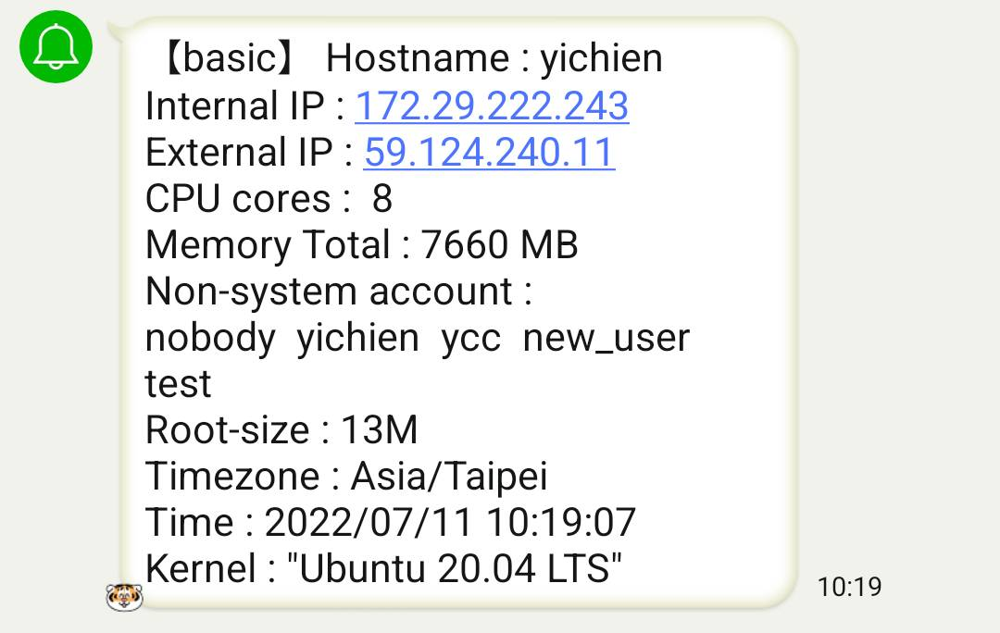
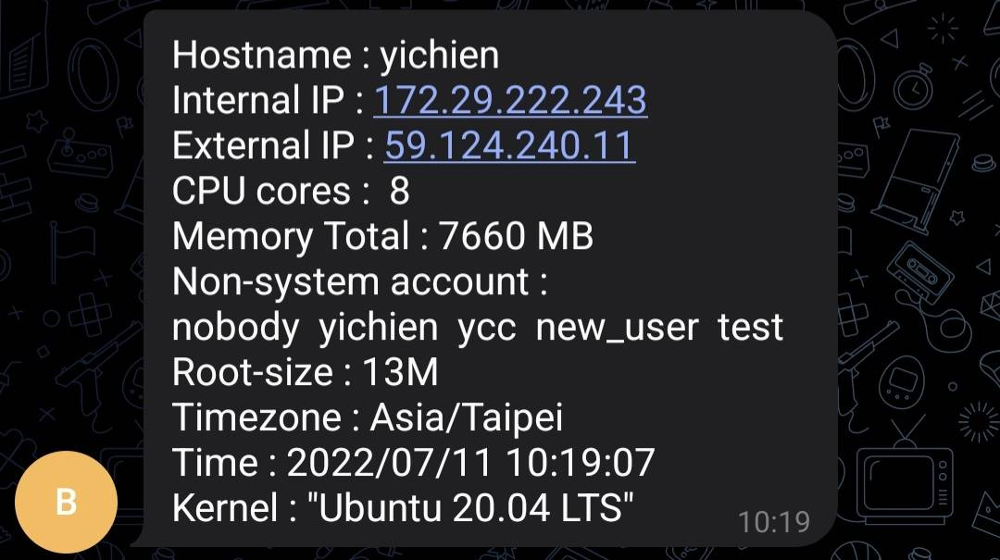

# Shell + Alert
## Shell script
* 腳本內容
```
➜  shell cat basic.sh
#!/bin/bash

getinip=$(ifconfig eth0 | grep netmask | awk '{print $2}')
getexip=$(curl -L icanhazip.com.)
getcpu=$( cat /proc/cpuinfo | grep "cpu cores" | uniq | cut -d ':' -f 2)
getmem=$(free -m | grep "Mem" | awk '{print $2}')
user1=$(cat /etc/passwd | cut -d ":" -f 3)
getroot=$(cd /root; du -sh | awk '{print $1}')
gettimezone=$(cat /etc/timezone)
gettime=$(date +"%Y/%m/%d %H:%M:%S")
getkernel=$(cat /etc/os-release | grep "PRETTY" | cut -d "=" -f 2)

echo -e ""
echo "Hostname : $(hostname)"
echo "Internal IP : $getinip"
echo "External IP : $getexip"
echo "CPU cores : $getcpu"
echo "Memory Total : $getmem MB"
echo "Non-system account : "
for i in $user1
do
    if [ "$i" -ge 1000 ]
    then
        #echo "$i"
        user2=$(cat /etc/passwd | cut -d ":" -f 1,2,3 | grep $i | cut -d ":" -f 1)
        echo -n "$user2  "
    fi
done
echo -e ""
echo "Root-size : $getroot"
echo "Timezone : $gettimezone"
echo "Time : $gettime"
echo "Kernel : $getkernel"
```
* 正則表達式
```
➜  shell cat /etc/passwd | grep -E '^.*:.*:[0-9]{4,5}:[0-9]{4,5}' | cut -d ":" -f 1
nobody
yichien
ycc
new_user
test
```
* 執行腳本
```
➜  shell ./basic.sh
Hostname : yichien
Internal IP : 172.29.222.243
External IP : 59.124.240.11
CPU cores :  8
Memory Total : 7660 MB
non-system account :
nobody  yichien  ycc  new_user  test
root-size : 13M
Timezone : Asia/Taipei
Time : 2022/07/11 09:38:43
OS : "Ubuntu 20.04 LTS"
```
## 與 Line-Notify 結合
* 腳本內容
```
➜  shell cat line_notify_send.sh
#!/bin/bash
# LINE Notify Token - Media > "Send to".
TOKEN=XXXXX

./basic.sh > basic.txt
message=$(cat basic.txt)

curl -s -X POST -H "Authorization: Bearer $TOKEN" -F "message=$message" https://notify-api.line.me/api/notify
```
* 執行腳本
```
➜  shell ./line_notify_send.sh
{"status":200,"message":"ok"}#
```
> 

## 與 Telegram Bot 結合
* 腳本內容
```
➜  shell cat line_notify_send.sh
#!/bin/bash
# LINE Notify Token - Media > "Send to".
TOKEN_line_notify=XXXXX

TOKEN_telegram=XXXXX
chat_ID=XXXXX
MODE='HTML'

./basic.sh > basic.txt
message=$(cat basic.txt)

curl -s -X POST -H "Authorization: Bearer $TOKEN_line_notify" -F "message=$message" https://notify-api.line.me/api/notify

URL="https://api.telegram.org/bot${TOKEN_telegram}/sendMessage"         #api接口

curl -s -X POST $URL -d chat_id=${chat_ID}  -d parse_mode=${MODE} -d text="${message}"
```
* 執行腳本
```
➜  shell ./line_notify_send.sh
{"status":200,"message":"ok"}{"ok":true,"result":{"message_id":7,"from":{"id":5455227751,"is_bot":true,"first_name":"basic","username":"basic_shell_script_bot"},"chat":{"id":-669218974,"title":"basic_test","type":"group","all_members_are_administrators":true},"date":1657505949,"text":"Hostname : yichien\nInternal IP : 172.29.222.243\nExternal IP : 59.124.240.11\nCPU cores :  8\nMemory Total : 7660 MB\nNon-system account : \nnobody  yichien  ycc  new_user  test  \nRoot-size : 13M\nTimezone : Asia/Taipei\nTime : 2022/07/11 10:19:07\nKernel : \"Ubuntu 20.04 LTS\"","entities":[{"offset":33,"length":14,"type":"url"},{"offset":62,"length":13,"type":"url"}]}}#
```
> 


### 補充
` wget http://ipecho.net/plain -O - -q ; echo`
> 如果你不想將下載的檔案儲存在本地，而只是想將其顯示在標準輸出（stdout）裡，可以使用 --output-document 選項，同時後面再跟上一個 - 號


