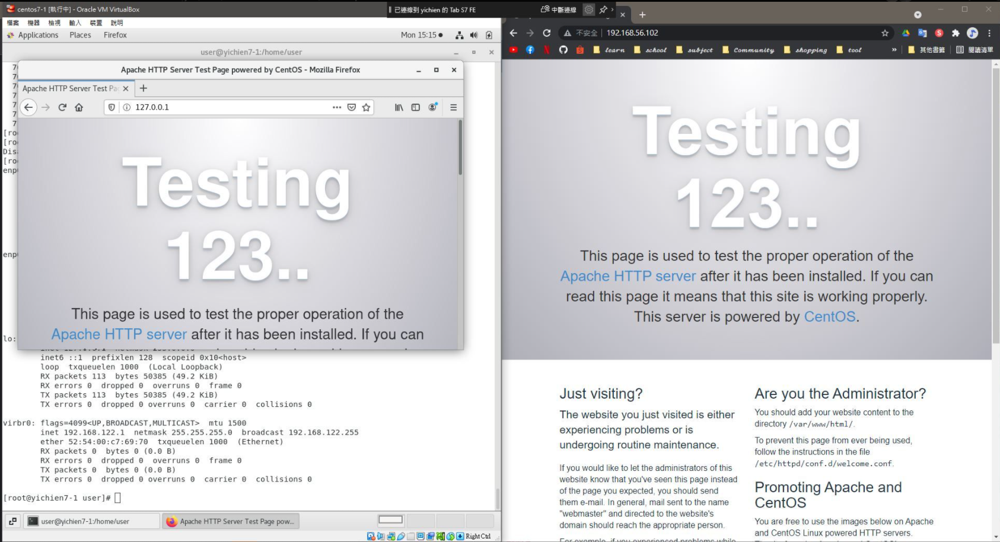
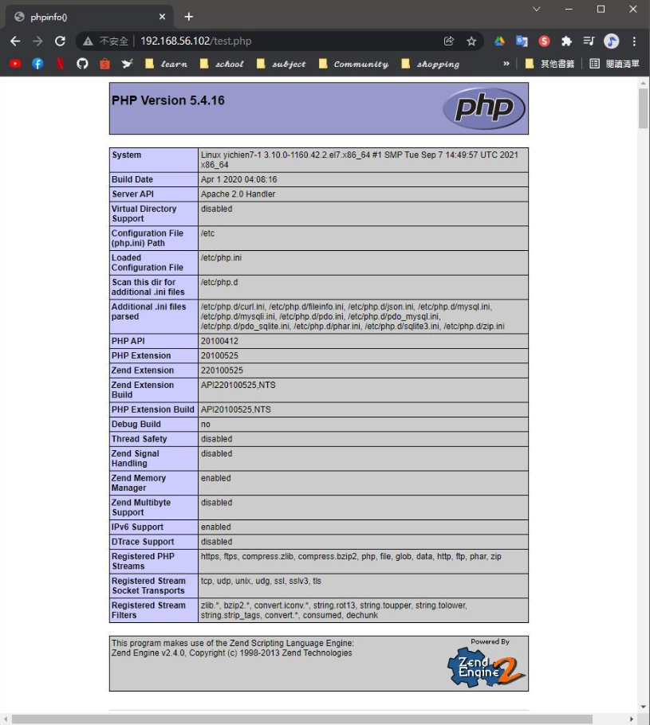

# 📝 APACHE + MARIADB SERVER 
# 📖 APACHE
### 👉 安裝 APACHE + 初始設定
```
01 # yum install httpd
02 # systemctl stop firewalld
03 # getenforce
    Disabled
    // 如果沒有disabled要修改vim /etc/selinux/config更改完要重開機
```

* Linux 打開網頁打 127.0.0.1
* Windows 打開網頁打 IP 位置
## 📖 MARIADB
### 👉 安裝 MARIADB + 初始設定
```
04 # yum install mariadb-server mariadb
05 # systemctl start mariadb.service
06 # systemctl status mariadb.service
    ● mariadb.service - MariaDB database server
    Loaded: loaded (/usr/lib/systemd/system/mariadb.service; disabled; vendor preset: disabled)
    Active: active (running) since Fri 2021-12-03 15:28:53 CST; 12s ago
07 # mysql_secure_installation
    //password : 123456
08 # mysql -u root -p
    Enter password: 
    Welcome to the MariaDB monitor.
```
# 📖 MYSQL
### 👉 查看資料庫 `show databases;`
```
MariaDB [(none)]> show databases;
+--------------------+
| Database           |
+--------------------+
| information_schema |
| mysql              |
| performance_schema |
| test               |
+--------------------+
4 rows in set (0.00 sec)
```
### 👉 創建資料庫 `create database testdb;`

```
MariaDB [(none)]> create database testdb;
Query OK, 1 row affected (0.00 sec)
MariaDB [testdb]> show databases;
+--------------------+
| Database           |
+--------------------+
| information_schema |
| mysql              |
| performance_schema |
| test               |
| testdb             |
+--------------------+
5 rows in set (0.00 sec)
```
### 👉 使用資料庫 `use testdb;`
```
MariaDB [(none)]> use testdb;
Database changed
```

### 👉 創建表格 `create table addrbook(name varchar(50) not null,phone varchar(10));`
```
MariaDB [testdb]> create table addrbook(name varchar(50) not null,phone varchar(10));
Query OK, 0 rows affected (0.31 sec)
```

### 👉 加入資料 `insert into addrbook(name, phone) values ("xxx","xxx");`
```
MariaDB [testdb]> insert into addrbook(name, phone) values ("mary","0987654321");
Query OK, 1 row affected (0.30 sec)

MariaDB [testdb]> insert into addrbook(name, phone) values ("tom","1234567890");
Query OK, 1 row affected (0.29 sec)
```

### 👉 顯示資料 `select * from addrbook;`
```
MariaDB [testdb]> select * from addrbook;
+------+------------+
| name | phone      |
+------+------------+
| mary | 0987654321 |
| tom  | 1234567890 |
+------+------------+
2 rows in set (0.00 sec)
```

# 📖 PHP

```
09 # yum install php php-mysql
10 # systemctl restart httpd
11 # cd /var/www/html
12 # ls
    hi.php  index.html  test.php
13 # gedit test.php 
    <?php
    phpinfo();
    ?>
```


### 👉 連結到資料庫顯示資料 ( APACHE + MARIADB + PHP )
```
14 # cd /var/www/html
15 # gedit hi.php 
    <?php
    $servername="localhost";
    $username="root";
    $password="123456";
    $dbname="testdb";

    $conn = new mysqli($servername,$username,$password,$dbname);

    if($conn->donnect_error){
        die("connection failed:".$conn->connect_error);
    }
    //echo "connection ok"
    $sql="select name,phone from addrbook";
    $result=$conn->query($sql);

    if($result->num_rows>0){
    while($row=$result->fetch_assoc()){
        echo " name : ". $row["name"]."<br>";
        echo " phone : ".$row["phone"]."<br>";
    }
    }
    ?>
```

