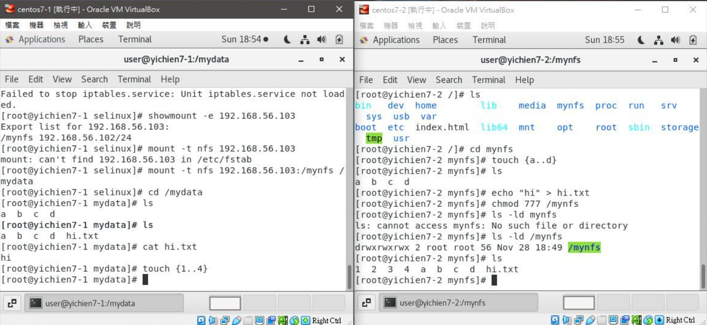

# 📝 NFS 連線
## 📖 
### 🔖 
#### 👉 
##### 📍
# 📖 NFS 伺服器
## 🔖 前置設定
```
01 # getenforce
    Disabled
02 # systemctl stop firewalld
```
## 🔖 NFS SERVER :
```
03 # yum install nfs-utils
04 # gedit /etc/exports     //編輯 exports 檔案，新增從機
    1   /mynfs 192.168.56.0/24(rw,sync,fsid=0)
    2   /mynfs 192.168.56.0/24(rw,sync,no_root_squash,no_all_squash)
    
05 # systemctl start rpcbind
06 # systemctl start nfs-server
07 # rpcinfo -p     //確認NFS伺服器啟動成功
08 # exportfs -r     //檢查 NFS 伺服器是否掛載我們想共享的目錄
09 # exportfs     //使配置生效
    /mynfs        	192.168.56.0/24
10 # chmod 777 /mynfs
```

## 🔖 NFS CLIENT :
```
11 # yum install nfs-utils
12 # systemctl start rpcbind
13 # showmount -e 192.168.56.103   //Server's IP
    Export list for 192.168.56.103:
    /mynfs 192.168.56.102/24
14 # mount -t nfs 192.168.56.103:/mynfs /mydata     //掛載
15 # umount /mydata     //卸載
```


# 📖使用ifconfig設定網路卡
### 👉 設定網路卡
```
16 # ip addr add  192.168.56.255 brd + dev enp0s8
17 # ip addr show enp0s8
    3: enp0s8: <BROADCAST,MULTICAST,UP,LOWER_UP> mtu 1500 qdisc pfifo_fast state UP group default qlen 1000
        link/ether 08:00:27:9d:20:2e brd ff:ff:ff:ff:ff:ff
        inet 192.168.56.102/24 brd 192.168.56.255 scope global noprefixroute dynamic enp0s8
        valid_lft 359sec preferred_lft 359sec
        inet 192.168.56.255/32 scope global enp0s8
        valid_lft forever preferred_lft forever
        inet6 fe80::4573:993b:3a9d:7d8d/64 scope link noprefixroute 
        valid_lft forever preferred_lft forever
```

### 👉 設備統計資料
```
18 # ip -s link show enp0s8
    3: enp0s8: <BROADCAST,MULTICAST,UP,LOWER_UP> mtu 1500 qdisc pfifo_fast state UP mode DEFAULT group default qlen 1000
        link/ether 08:00:27:9d:20:2e brd ff:ff:ff:ff:ff:ff
        RX: bytes  packets  errors  dropped overrun mcast   
        8371817    28065    0       0       0       338     
        TX: bytes  packets  errors  dropped carrier collsns 
        74262      515      0       0       0       0
```
### 👉 顯示路由
```
19 # ip route show
    default via 10.0.2.2 dev enp0s3 proto dhcp metric 101 
    10.0.2.0/24 dev enp0s3 proto kernel scope link src 10.0.2.15 metric 101 
    192.168.56.0/24 dev enp0s8 proto kernel scope link src 192.168.56.102 metric 100 
    192.168.122.0/24 dev virbr0 proto kernel scope link src 192.168.122.1
```
### 👉 新增路由
```
20 # ip route add default via 192.168.56.2
21 # ip route show
    default via 192.168.56.2 dev enp0s8 
    default via 10.0.2.2 dev enp0s3 proto dhcp metric 101 
    10.0.2.0/24 dev enp0s3 proto kernel scope link src 10.0.2.15 metric 101 
    192.168.56.0/24 dev enp0s8 proto kernel scope link src 192.168.56.102 metric 100 
    192.168.122.0/24 dev virbr0 proto kernel scope link src 192.168.122.1
```
### 👉 刪除路由
```
22 # ip route del default via 192.168.56.2
23 # ip route show
    default via 10.0.2.2 dev enp0s3 proto dhcp metric 101 
    10.0.2.0/24 dev enp0s3 proto kernel scope link src 10.0.2.15 metric 101 
    192.168.56.0/24 dev enp0s8 proto kernel scope link src 192.168.56.102 metric 100 
    192.168.122.0/24 dev virbr0 proto kernel scope link src 192.168.122.1
```
## 🔖 取消 NetworkManager 改用 Network
### 👉 系統網路組態目錄
```
24 # ls /etc/sysconfig/network-scripts
    ifcfg-enp0s3              ifdown-sit       ifup-plusb
    ifcfg-lo                  ifdown-Team      ifup-post
    ifcfg-Wired_connection_2  ifdown-TeamPort  ifup-ppp
    ifdown                    ifdown-tunnel    ifup-routes
    ifdown-bnep               ifup             ifup-sit
    ifdown-eth                ifup-aliases     ifup-Team
    ifdown-ib                 ifup-bnep        ifup-TeamPort
    ifdown-ippp               ifup-eth         ifup-tunnel
    ifdown-ipv6               ifup-ib          ifup-wireless
    ifdown-isdn               ifup-ippp        init.ipv6-global
    ifdown-post               ifup-ipv6        network-functions
    ifdown-ppp                ifup-isdn        network-functions-ipv6
    ifdown-routes             ifup-plip
```
### 👉 ifconfig
```
25 # ifconfig enp0s3
    enp0s3: flags=4163<UP,BROADCAST,RUNNING,MULTICAST>  mtu 1500
        inet 10.0.2.15  netmask 255.255.255.0  broadcast 10.0.2.255
        inet6 fe80::a00:27ff:fe41:abcc  prefixlen 64  scopeid 0x20<link>
        ether 08:00:27:41:ab:cc  txqueuelen 1000  (Ethernet)
        RX packets 607  bytes 810522 (791.5 KiB)
        RX errors 0  dropped 0  overruns 0  frame 0
        TX packets 194  bytes 21560 (21.0 KiB)
        TX errors 0  dropped 0 overruns 0  carrier 0  collisions 0
26 # ip route show
    default via 10.0.2.2 dev enp0s3 
    10.0.2.0/24 dev enp0s3 proto kernel scope link src 10.0.2.15 
    169.254.0.0/16 dev enp0s3 scope link metric 1002 
    169.254.0.0/16 dev enp0s8 scope link metric 1003 
    192.168.56.0/24 dev enp0s8 proto kernel scope link src 192.168.56.102 
    192.168.122.0/24 dev virbr0 proto kernel scope link src 192.168.122.1
```
### 👉 改用 Network 連線
```
27 # systemctl stop NetworkManager
28 # systemctl disable NetworkManager
29 # systemctl start network
```

### 👉 內部網路設定 ( 10.0.2.15 -> 10.0.2.20 )
```
30 # cd /etc/sysconfig/network-scripts/
31 # systemctl restart network
32 # ifconfig enp0s3
    enp0s3: flags=4163<UP,BROADCAST,RUNNING,MULTICAST>  mtu 1500
            inet 10.0.2.15  netmask 255.255.255.0  broadcast 10.0.2.255
            inet6 fe80::a00:27ff:fe41:abcc  prefixlen 64  scopeid 0x20<link>
            ether 08:00:27:41:ab:cc  txqueuelen 1000  (Ethernet)
            RX packets 608  bytes 811112 (792.1 KiB)
            RX errors 0  dropped 0  overruns 0  frame 0
            TX packets 229  bytes 28319 (27.6 KiB)
            TX errors 0  dropped 0 overruns 0  carrier 0  collisions 0
33 # gedit ifcfg-enp0s3
    //原設定
    TYPE=Ethernet
    PROXY_METHOD=none
    BROWSER_ONLY=no
    BOOTPROTO=dhcp
    DEFROUTE=yes
    IPV4_FAILURE_FATAL=no
    IPV6INIT=yes
    IPV6_AUTOCONF=yes
    IPV6_DEFROUTE=yes
    IPV6_FAILURE_FATAL=no
    IPV6_ADDR_GEN_MODE=stable-privacy
    NAME=enp0s3
    HWADDR="08:00:27:41:ab:cc"
    UUID=4423e055-171d-4dcc-a816-186e81e5e4c5
    DEVICE=enp0s3
    ONBOOT=no
    
    //基本設定
    TYPE=Ethernet
    BOOTPROTO=dhcp
    NAME=enp0s3
    HWADDR="08:00:27:41:ab:cc"
    DEVICE=enp0s3
    ONBOOT=yes
    
    //靜態網路設定
    TYPE=Ethernet
    BOOTPROTO=static
    NAME=enp0s3
    HWADDR="08:00:27:41:ab:cc"
    DEVICE=enp0s3
    ONBOOT=yes
    IPADDR=10.0.2.20
    NETMASK=255.255.255.0
    GATEWAY=10.0.2.2

34 # systemctl restart network
35 # ifconfig enp0s3     //靜態網路設定
    enp0s3: flags=4163<UP,BROADCAST,RUNNING,MULTICAST>  mtu 1500
            inet 10.0.2.20  netmask 255.255.255.0  broadcast 10.0.2.255
            inet6 fe80::a00:27ff:fe41:abcc  prefixlen 64  scopeid 0x20<link>
            ether 08:00:27:41:ab:cc  txqueuelen 1000  (Ethernet)
            RX packets 611  bytes 811368 (792.3 KiB)
            RX errors 0  dropped 0  overruns 0  frame 0
            TX packets 264  bytes 34462 (33.6 KiB)
            TX errors 0  dropped 0 overruns 0  carrier 0  collisions 0
```

### 👉 外部網路設定 ( 192.168.56.101 -> 192.168.56.111 )
```
36  # gedit ifcfg-enp0s8
    TYPE=Ethernet
    BOOTPROTO=static
    NAME=enp0s8
    HWADDR="08:00:27:db:2e:02"
    DEVICE=enp0s8
    ONBOOT=yes
    IPADDR=192.168.56.111
    NETMASK=255.255.255.0
37 # gedit /etc/resolv.conf
    ; generated by /usr/sbin/dhclient-script
    nameserver 8.8.8.8
    nameserver 9.9.9.9
```
### 👉 失敗回復指令
```
37 # systemctl start NetworkManager
38 # nmcli
    enp0s3: connected to enp0s3
            "Intel 82540EM"
            ethernet (e1000), 08:00:27:41:AB:CC, hw, mtu 1500
            inet4 10.0.2.15/24
            route4 0.0.0.0/0
            route4 0.0.0.0/0
            route4 10.0.2.0/24
            route4 169.254.0.0/16
            inet6 fe80::be4d:dd6c:bc2d:45e6/64
            route6 fe80::/64
            route6 ff00::/8

    enp0s8: connected to Wired connection 1
            "Intel 82540EM"
            ethernet (e1000), 08:00:27:9D:20:2E, hw, mtu 1500
            inet4 192.168.56.102/24
            route4 192.168.56.0/24
            inet6 fe80::4573:993b:3a9d:7d8d/64
            route6 fe80::/64
            route6 ff00::/8
```
