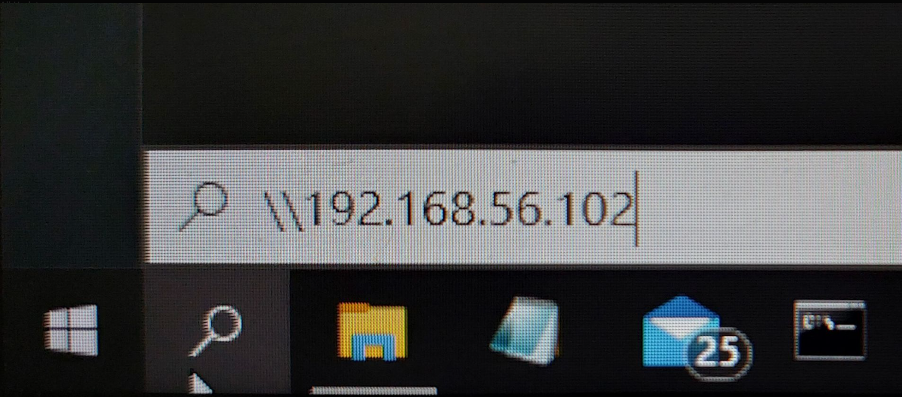
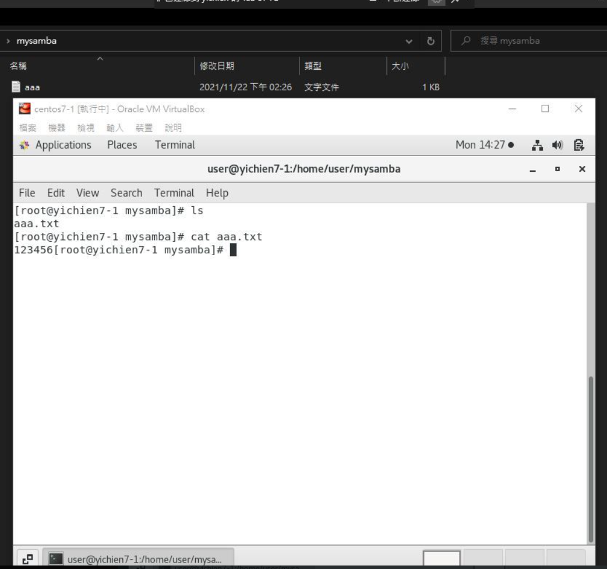

# 📝 SAMBA
* 在 Windows 內要存取 Linux 的檔案，除了用 FTP 或 SFTP 的方式來存取外，Samba 也是一個好選擇。Samba 能讓你透過「網路上的芳鄰」的方式直接存取檔案，甚至透過 Windows 的「連線到網路磁碟機」功能，使用起來就和本機硬碟沒什麼兩樣了
## 📖 
### 🔖 
#### 👉 
##### 📍 
## 🔖 安裝及設定
```
01 # yum install samba samba-client samba-common -y
02 # mkdir /home/user/mysamba
03 # gedit /etc/samba/smb.conf
    [global]
        workgroup = SAMBA
        security = user
        passdb backend = tdbsam
        printing = cups
        printcap name = cups
        load printers = yes
        cups options = raw

    [homes]
        comment = Home Directories
        valid users = %S, %D%w%S
        browseable = No
        read only = No
        inherit acls = Yes

    [printers]
        comment = All Printers
        path = /var/tmp
        printable = Yes
        create mask = 0600
        browseable = No

    [print$]
        comment = Printer Drivers
        path = /var/lib/samba/drivers
        write list = @printadmin root
        force group = @printadmin
        create mask = 0664
        directory mask = 0775

    [mysamba]
        comment = Shared Directory
        path = /home/user/mysamba
        browseable = yes
        writable = yes
        create mode = 0660
        directory mode = 2770
        public = yes
        user = user
04 # testparm     //檢查smb.conf配置檔案的內部正確性
05 # systemctl restart smb
06 # systemctl status smb
    ● smb.service - Samba SMB Daemon
    Loaded: loaded (/usr/lib/systemd/system/smb.service; enabled; vendor preset: disabled)
    Active: active (running) since Sun 2021-12-05 16:03:44 CST; 7s ago
    [root@yichien7-1 user]# ip addr show enp0s8
    3: enp0s8: <BROADCAST,MULTICAST,UP,LOWER_UP> mtu 1500 qdisc pfifo_fast state UP group default qlen 1000
        link/ether 08:00:27:9d:20:2e brd ff:ff:ff:ff:ff:ff
        inet 192.168.56.102/24 brd 192.168.56.255 scope global noprefixroute dynamic enp0s8
        valid_lft 338sec preferred_lft 338sec
        inet6 fe80::4573:993b:3a9d:7d8d/64 scope link noprefixroute 
        valid_lft forever preferred_lft forever
```

    
- testparm
    
    ```markdown
    [global]
    	printcap name = cups
    	security = USER
    	workgroup = SAMBA
    	idmap config * : backend = tdb
    	cups options = raw
    
    [homes]
    	browseable = No
    	comment = Home Directories
    	inherit acls = Yes
    	read only = No
    	valid users = %S %D%w%S
    
    [printers]
    	browseable = No
    	comment = All Printers
    	create mask = 0600
    	path = /var/tmp
    	printable = Yes
    
    [print$]
    	comment = Printer Drivers
    	create mask = 0664
    	directory mask = 0775
    	force group = @printadmin
    	path = /var/lib/samba/drivers
    	write list = @printadmin root
    
    [mysamba]
    	comment = Shared Directory
    	create mask = 0660
    	directory mask = 02770
    	guest ok = Yes
    	path = /home/user/mysamba
    	read only = No
    ```

## 🔖 設定密碼 ROOT (password : centos)
```
07 # smbpasswd -a root
    New SMB password:
    Retype new SMB password:
08 # ls -al
    total 8
    drwxrwxrwx   2 root root   21 Nov 22 14:26 .
    drwx------. 23 user user 4096 Dec  5 15:02 ..
    -rw-rw----   1 root root    6 Nov 22 14:26 aaa.txt
```
## 🔖 密碼設定 USER
```
09 # passwd yc
    Changing password for user yc.
    New password: 
    BAD PASSWORD: The password is shorter than 8 characters
    Retype new password: 
    passwd: all authentication tokens updated successfully.
10 # smbpasswd -a yc
    New SMB password:
    Retype new SMB password:
    Added user yc.
```



## 🔖 取消連線 (cmd - net use * /delete)
```
C:\Users\yichien>net use * /delete
您的遠端連線如下:

                    \\192.168.56.5\IPC$
繼續執行將會取消連線。

要繼續執行這項操作嗎? (Y/N) [N]: y
命令已經成功完成。
```

