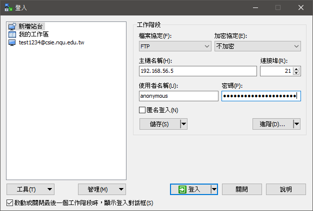

# 📝 VSFTP
## 🔖 安裝
```
01 # yum install vsftpd -y
02 # systemctl start vsftpd
03 # systemctl status vsftpd
04 # netstat -tunlp | grep 21
    tcp6       0      0 :::80                   :::*                    LISTEN      5021/httpd          
    tcp6       0      0 :::21                   :::*                    LISTEN      6660/vsftpd
05 # systemctl stop firewalld
06 # gedit /etc/vsftpd/vsftpd.conf
    anon_upload_enable=YES     (#刪除)
    anon_mkdir_write_enable=YES     (#刪除)
```
### 👉 其他指令
| ls | 列出目前目錄下的檔案清單    (初始位置/var/ftp) |
| --- | --- |
| cd | 切換目錄 |
| get | 下載伺服器上的檔案至用戶端 |
| put | 將用戶端的檔案上傳至伺服器上 |
| asc | 設定傳輸格式為ASCII文字模式 |
| bin | 設定傳輸格式為二進制模式binary模式 |
| mkdir | 在伺服器上建立新目錄 |
### 👉 文字模式連線 (windows cmd)
```
C:\Users\yichien>ftp 192.168.56.5
已連線到 192.168.56.5。
220 (vsFTPd 3.0.2)
200 Always in UTF8 mode.
使用者 (192.168.56.5:(none)): anonymous
331 Please specify the password.
密碼:
230 Login successful.
ftp> bin            //傳輸前要先切換
200 Switching to Binary mode.
ftp> get a
200 PORT command successful. Consider using PASV.
150 Opening BINARY mode data connection for a (0 bytes).
226 Transfer complete.
ftp> mget a*        //下載多個檔案
200 Switching to ASCII mode.
mget a1? y
200 PORT command successful. Consider using PASV.
150 Opening BINARY mode data connection for a1 (0 bytes).
226 Transfer complete.
ftp> prompt off     //詢問模式關閉
互動模式 關閉 。
ftp> ls
200 PORT command successful. Consider using PASV.
150 Here comes the directory listing.
a1
a2
a3
226 Directory send OK.
ftp> put a
200 PORT command successful. Consider using PASV.
550 Permission denied.     //開權限chmod 777 & 更改虛擬機/etc/vsftpd/vsftpd.conf
ftp> put a
200 PORT command successful. Consider using PASV.
150 Ok to send data.
226 Transfer complete.
```
### 👉 圖形模式連線 (WinSCP)

### 👉 使用者可以登入不可以切換目錄
```
07 # gedit /etc/vsftpd/vsftpd.conf
    chroot_local_user=YES     (#刪除)
    allow_writeable_chroot=YES     (自行輸入)
```
### 👉 限制使用者登入
```
08 # gedit /etc/vsftpd/user_list
    # vsftpd userlist
    # If userlist_deny=NO, only allow users in this file
    # If userlist_deny=YES (default), never allow users in this file, and
    # do not even prompt for a password.
    # Note that the default vsftpd pam config also checks /etc/vsftpd/ftpusers
    # for users that are denied.
    root
    bin
    daemon
    adm
    lp
    sync
    shutdown
    halt
    mail
    news
    uucp
    operator
    games
    nobody
    tom     (自行輸入使用者)
```
### 👉 嘗試使用限制使用者登入 
```
09 # gedit /etc/httpd/conf/httpd.conf
    <Directory "/var/www/html">
        Order allow,deny
        Allow from all             允許所有連接
        Deny from 192.168.56.103   除了這一個IP
10 # ftp 192.168.56.5
    Connected to 192.168.56.5 (192.168.56.5).
    220 (vsFTPd 3.0.2)
    Name (192.168.56.5:root): tom
    530 Permission denied.
    Login failed.
```


🖊️ editor : yi-chien Liu

