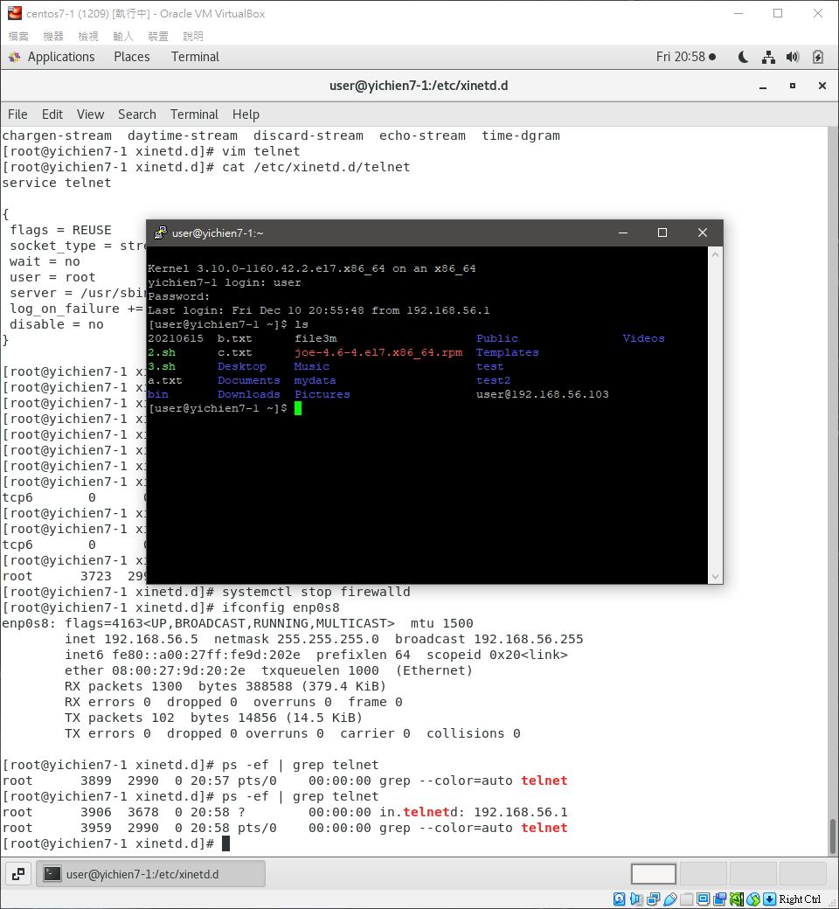

# 📝 telnet & xinetd
## 🔖 前置作業
```
01 # yum install telnet
02 # yum install telnet-server
03 # yum -y install xinetd
04 # rpm -qa | grep xinetd
    xinetd-2.3.15-14.el7.x86_64
05 # rpm -qa | grep telnet-server
    telnet-server-0.17-66.el7.x86_64
06 # cat /etc/xinetd.d/telnet
    service telnet
    {
    flags = REUSE
    socket_type = stream
    wait = no
    user = root
    server = /usr/sbin/in.telnetd
    log_on_failure += USERID
    disable = no
    }
07 # systemctl restart xinetd.service
08 # netstat -tnl | grep 23
    tcp6       0      0 :::23                   :::*                    LISTEN
09 # ps -ef | grep telnet
    root      3899  2990  0 20:57 pts/0    00:00:00 grep --color=auto telnet
10 # ps -ef | grep telnet
    root      3906  3678  0 20:58 ?        00:00:00 in.telnetd: 192.168.56.1
    root      3959  2990  0 20:58 pts/0    00:00:00 grep --color=auto telnet
```


## 🔖 UserDir 個人網頁模組
```
11 # /etc/httpd/conf.d/userdir.conf
    UserDir enabled   改成enable
    UserDir public_html   #拿掉取消註解
```
### 👉 USERDIR
```
12 # systemctl restart httpd    
13 # su - user     ROOT 切換到其他使用者
    Last login: Sun Dec 26 11:52:25 CST 2021 on :0
14 $ mkdir public_html
15 $ ls -ld public_html/
    drwxr-xr-x 2 user user 24 Dec  6 15:47 public_html/
16 $ cd public_html
17 $ echo "I am USER~" > index.html 
18 $ cat index.html 
    I am USER~
19 $ cd ..
20 $ chmod 777 public_html/     更改權限
```
* 開啟網頁 `http://<IP>/~user/`
