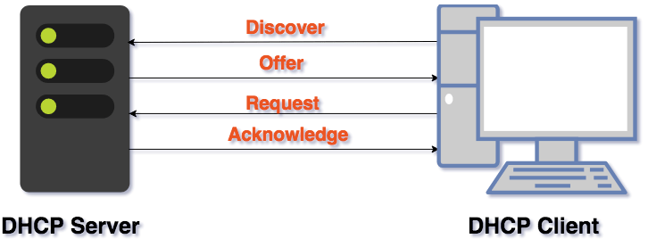

# 📝 設定 Web 虚擬主機 + DHCP + NAT
# 📖 
## 🔖 
### 👉 
#### 📍


# 📖 WEB 虛擬主機
### 👉 登入設定
```
01 # cd /var/www/html
02 # mkdir files
03 # cd files
04 # htpasswd -c .htpasswd user
    New password: 
    Re-type new password: 
    Adding password for user user
05 # htpasswd .htpasswd yc
    New password: 
    Re-type new password: 
    Adding password for user yc
06 # gedit .htaccess
    AuthType Basic
    AuthName "Private File Area"
    AuthUserFile /var/www/html/files/.htpasswd
    Require valid-user
07 # ls -al
    total 8
    drwxr-xr-x  2 root root  40 Dec 20 22:44 .
    drwxr-xr-x. 3 root root  67 Dec 20 21:57 ..
    -rw-r--r--  1 root root 106 Dec 20 22:44 .htaccess
    -rw-r--r--  1 root root  84 Dec 20 22:42 .htpasswd
08 # gedit /etc/httpd/conf/httpd.conf
    <Directory /var/www/html/files>
        AllowOverride AuthConfig
    </Directory>
```


### 👉 流程設定
```
09 # cd /var/www/html
10 # mkdir files
11 # cd /etc/httpd/conf.d
12 # gedit vhosts.conf
    <VirtualHost _default_:80>
    ServerName www.example.com
    DocumentRoot /var/www/html
    </VirtualHost>
    <VirtualHost *:80>
    ServerName test1.example.com
    DocumentRoot /var/www/vhosts/test1
    </VirtualHost>
    <VirtualHost *:80>
    ServerName test2.example.com
    DocumentRoot /var/www/vhosts/test2
    </VirtualHost>
13 # mkdir -p /var/www/vhosts/test1
14 # mkdir -p /var/www/vhosts/test2
15 # cd /var/www/vhosts/test1
16 # echo "test1.example.com" > index.html
17 # cd /var/www/vhosts/test2
18 # echo "test2.example.com" > index.html
19 # systemctl restart httpd
```

* 最後更改`C:\Windows\System32\drivers\etc\hosts`檔案加入 IP(cmd:notepad)
```markdown
#
127.0.0.1 localhost
::1 localhost
# Added by Docker Desktop
192.168.1.106 host.docker.internal
192.168.1.106 gateway.docker.internal
192.168.6.3   test1.example.com
192.168.6.3   test2.example.com
192.168.56.5  test1.example.com
192.168.56.5  test2.example.com
# To allow the same kube context to work on the host and the container:
127.0.0.1 kubernetes.docker.internal
# End of section
```


# 📖 DHCP
* 準備兩台機器，一台直接啟用第三個網路(內部網路)，另一台只要啟動一個網路(內部網路)

|  | 內部網路卡 | 老師 / 我的 |  |
| --- | --- | --- | --- |
| Server | NO.3 | 7-1 / 7-3 |  |
| Client | NO.1 | 7-5 / 7-DHCP | 架設NAT Server |
* DHCP Server

* DHCP Client


### 👉 架構概念

* Source : 來源 / Destination  : 目的
**1. DHCP Discover Message**
```
    Source IP: 0.0.0.0     //未拿到IP
    Destination IP: 255.255.255.255     //廣播位置尋找伺服器
    Source MAC: DHCP Client Machine MAC Address     //來源網路卡號
    Destination MAC: FF:FF:FF:FF:FF:FF     //廣播去尋找DHCP Server
```
**2. DHCP Offer Message**
```
    Source IP: DHCP Server IP Address     //伺服器位置
    Destination IP: 255.255.255.255     //廣播位置
    Source MAC: DHCP Server Machine MAC Address     //來源網路卡號
    Destination MAC: DHCP client MAC Address     //DHCP Client卡號
```
**3. DHCP Request Message (廣播封包 確認DHCP Server)**
```
    Source IP: 0.0.0.0
    Destination IP: 255.255.255.255     //廣播位置
    Source MAC: DHCP Client Machine MAC Address
    Destination MAC: DHCP Server MAC Address
```
**4. DHCP Acknowledge Message**
```
    Source IP: DHCP Server IP Address
    Destination IP: 255.255.255.255
    Source MAC: DHCP Server Machine MAC Address
    Destination MAC: DHCP client MAC Address
```
### 👉 實際操作
#### 📍 Server
```
20 # ifconfig enp0s9
    enp0s9: flags=4163<UP,BROADCAST,RUNNING,MULTICAST>  mtu 1500
            inet6 fe80::4228:3e0:3787:e60b  prefixlen 64  scopeid 0x20<link>
            ether 08:00:27:51:de:37  txqueuelen 1000  (Ethernet)
            RX packets 213  bytes 21419 (20.9 KiB)
            RX errors 0  dropped 0  overruns 0  frame 0
            TX packets 887  bytes 149230 (145.7 KiB)
            TX errors 0  dropped 0 overruns 0  carrier 0  collisions 0
21 # ip addr add 192.168.10.1/24 brd + dev enp0s9
22 # ifconfig enp0s9
    enp0s9: flags=4163<UP,BROADCAST,RUNNING,MULTICAST>  mtu 1500
            inet 192.168.10.1  netmask 255.255.255.0  broadcast 192.168.10.255
            inet6 fe80::4228:3e0:3787:e60b  prefixlen 64  scopeid 0x20<link>
            ether 08:00:27:51:de:37  txqueuelen 1000  (Ethernet)
            RX packets 213  bytes 21419 (20.9 KiB)
            RX errors 0  dropped 0  overruns 0  frame 0
            TX packets 913  bytes 154222 (150.6 KiB)
            TX errors 0  dropped 0 overruns 0  carrier 0  collisions 0
23 # yum install dhcp
24 # gedit /etc/dhcp/dhcpd.conf
    subnet 192.168.10.0 netmask 255.255.255.0 {
        range 192.168.10.100 192.168.10.200;
        option routers 192.168.10.1;
        option domain-name-servers 8.8.8.8, 9.9.9.9;
        default-lease-time 600;
        max-lease-time 7200;
    }
25 # systemctl restart dhcpd.service
```
#### 📍 Client
```markdown
26 # systemctl stop NetworkManager
27 # ip addr add 192.168.10.2/24 brd + dev enp0s3
28 # ifconfig enp0s3
    enp0s3: flags=4163<UP,BROADCAST,RUNNING,MULTICAST>  mtu 1500
            inet 192.168.10.2  netmask 255.255.255.0  broadcast 192.168.10.255
            inet6 fe80::a00:27ff:fe41:abcc  prefixlen 64  scopeid 0x20<link>
            ether 08:00:27:41:ab:cc  txqueuelen 1000  (Ethernet)
            RX packets 106  bytes 33125 (32.3 KiB)
            RX errors 0  dropped 0  overruns 0  frame 0
            TX packets 374  bytes 38155 (37.2 KiB)
            TX errors 0  dropped 0 overruns 0  carrier 0  collisions 0
29 # dhclient enp0s3
30 # ifconfig enp0s3
    enp0s3: flags=4163<UP,BROADCAST,RUNNING,MULTICAST>  mtu 1500
            inet 192.168.10.100  netmask 255.255.255.0  broadcast 192.168.10.255
            inet6 fe80::a00:27ff:fe41:abcc  prefixlen 64  scopeid 0x20<link>
            ether 08:00:27:41:ab:cc  txqueuelen 1000  (Ethernet)
            RX packets 392  bytes 125919 (122.9 KiB)
            RX errors 0  dropped 0  overruns 0  frame 0
            TX packets 420  bytes 54624 (53.3 KiB)
            TX errors 0  dropped 0 overruns 0  carrier 0  collisions 0
```
* 如果設定未成功執行 
```markdown
31 # ifconfig enp0s3 0
32 # ip addr add 192.168.10.2/24 brd + dev enp0s3
33 # ifconfig
34 # ifconfig enp0s3**
```
# 📖 NAT Server
* Server
```
35 # cat /proc/sys/net/ipv4/ip_forward
    1    
36 # iptables -t nat -A POSTROUTING -s 192.168.10.0/24 -o enp0s3 -j MASQUERADE
```

### 👉 打開路由功能
```
37 # GEDIt /proc/sys/net/ipv4/ip_forward
1     //1即為打開
```
* 如果要關閉  echo 0 > /proc/sys/net/ipv4/ip_forward


## 📖 補充資料
* [[Network] DHCP 协议 DORA 过程 以及 超时处理](https://www.cnblogs.com/herryzz/p/13475197.html)


🖊️ editor : yi-chien Liu

