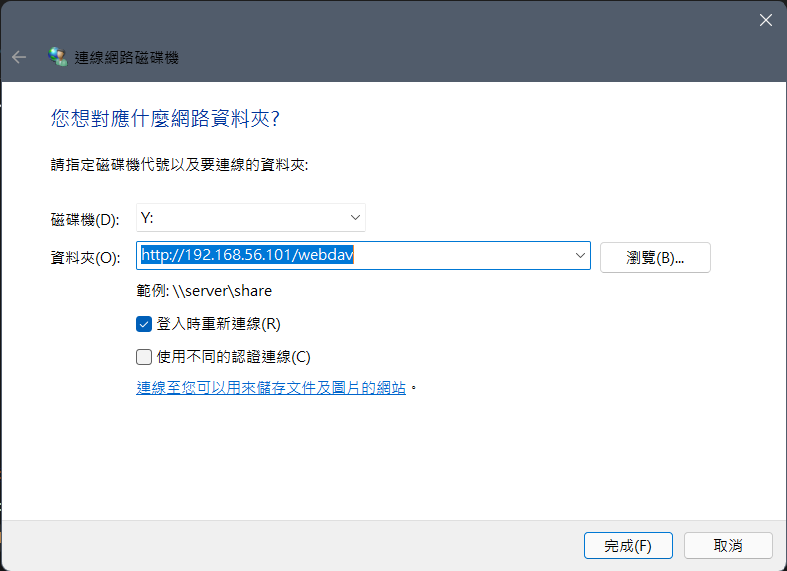
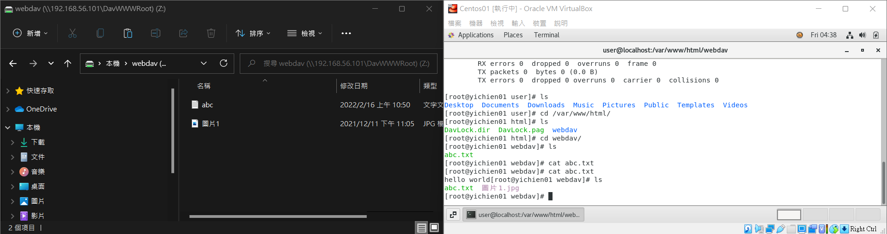
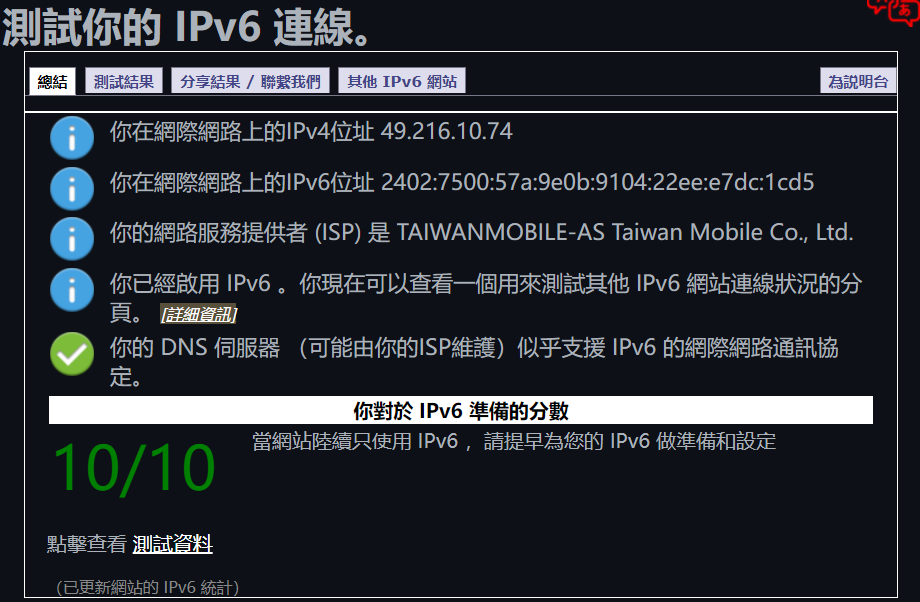
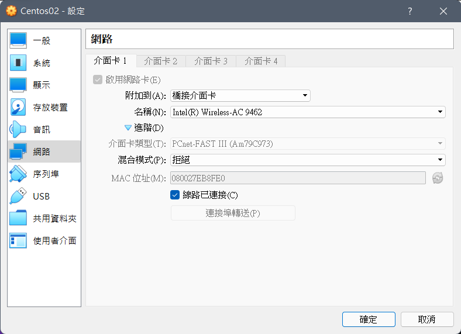
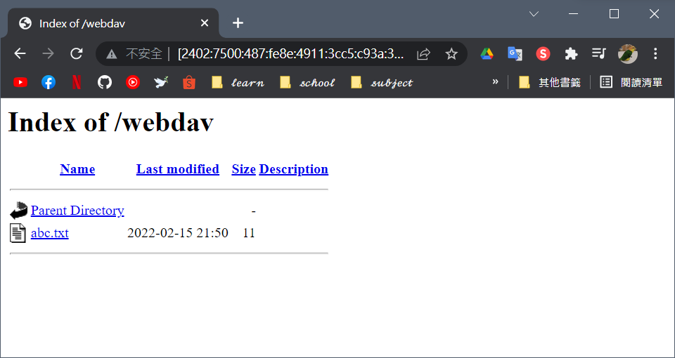
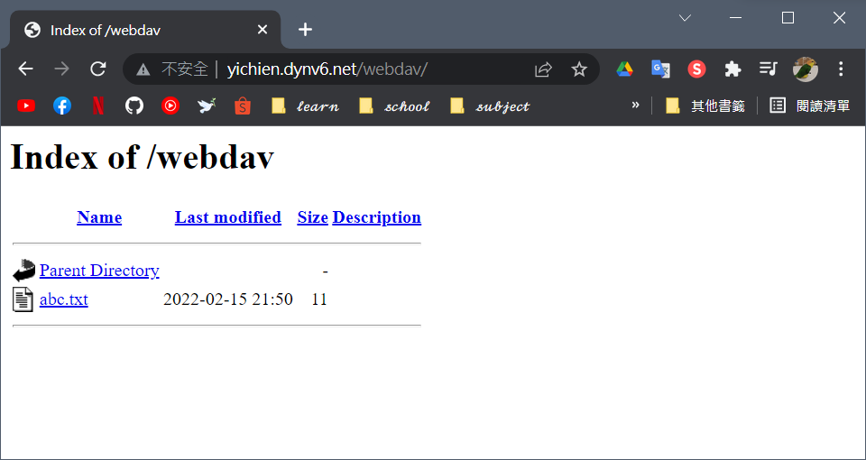

# 📝 Linux系統自動化運維第一週筆記20220216
# 📖 WebDAV Server
## 🔖 安裝步驟
### 👉 第一步:更新系統
```centos
01 yum install epel-release   //第三方資料庫
02 yum update
```

### 👉 第二步:安裝 Apache 啟動 Web 服務器
```
03 yum install httpd
04 systemctl start httpd
05 systemctl enable httpd
```
### 👉 第三步:設定 WebDAV
1. 確認相關模組的安裝 `httpd -M | grep dav` 會得到
```
 dav_module (shared)
 dav_fs_module (shared)
 dav_lock_module (shared)
```
2. 為 WebDAV 創建一個專用目錄
```
06 mkdir /var/www/html/webdav
07 chown -R apache:apache /var/www/html
08 ls -l
    total 0
    drwxr-xr-x. 2 apache apache 6 Feb 15 21:12 webdav
09 chmod -R 755 /var/www/html
10 ll
    total 0
    drwxr-xr-x. 2 apache apache 6 Feb 15 21:12 webdav
```

### 👉 第四步:為 WebDAV 創建虛擬主機
```
12 vim /etc/httpd/conf.d/welcome.conf 
    # 
    # This configuration file enables the default "Welcome" page if there
    # is no default index page present for the root URL.  To disable the
    # Welcome page, comment out all the lines below. 
    #
    # NOTE: if this file is removed, it will be restored on upgrades.
    #
    DavLockDB /var/www/html/DavLock
    <VirtualHost *:80>
        ServerAdmin webmaster@localhost
        DocumentRoot /var/www/html/webdav/
        ErrorLog /var/log/httpd/error.log
        CustomLog /var/log/httpd/access.log combined
        Alias /webdav /var/www/html/webdav
        <Directory /var/www/html/webdav>
            DAV On
        #    AuthType Basic
        #    AuthName "webdav"
        #    AuthUserFile /etc/httpd/.htpasswd
        #    Require valid-user
        </Directory>
    </VirtualHost>

    Alias /.noindex.html /usr/share/httpd/noindex/index.html
    Alias /noindex/css/bootstrap.min.css /usr/share/httpd/noindex/css/bootstrap.min.css
    Alias /noindex/css/open-sans.css /usr/share/httpd/noindex/css/open-sans.css
    Alias /images/apache_pb.gif /usr/share/httpd/noindex/images/apache_pb.gif
    Alias /images/poweredby.png /usr/share/httpd/noindex/images/poweredby.png
```

### 👉 重新啟動 Web 服務器
```
13 systemctl restart httpd
```

## 🔖 連接方式
* 本機 -> 連線到網路磁碟機 -> <b>http://"IP"/webdav<b>



## 🔖 結果顯示


## 🔖 IPV6連線
### 👉 第一步:測試 IPv6 連線
* [測試連結](https://test-ipv6.com/index.html.zh_TW)
* 測試結果
    
* 如果抓不到位置加入此設定
```
14 vim /etc/sysconfig/network-scripts/ifcfg-enp0s3
    NETWORKING_IPV6=yes
    IPV6_AUTOCONF=yes
15 systemctl restart NetworkManager
```

### 👉 第二步:虛擬機網路卡設定


### 👉 第三步:開啟 httpd 服務器
```
16 systemctl start httpd
```
### 👉 第四步:用 ipv6 連接
* http://["<b>IPV6<b>"]/webdav
    > EX : http://[2402:7500:487:fe8e:4911:3cc5:c93a:3f27]/webdav

    

### 👉 第五步:用網域名稱連接
* 先申請 Domain Name -> https://dynv6.com/
    > EX : http://yichien.dynv6.net/webdav

    


## 📖 補充資料
* [How to Setup a WebDAV Server Using Apache on CentOS 7](https://www.vultr.com/docs/how-to-setup-a-webdav-server-using-apache-on-centos-7/)


🖊️ editor : yi-chien Liu