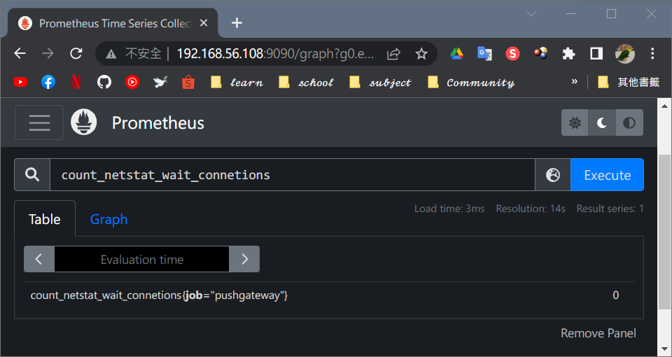
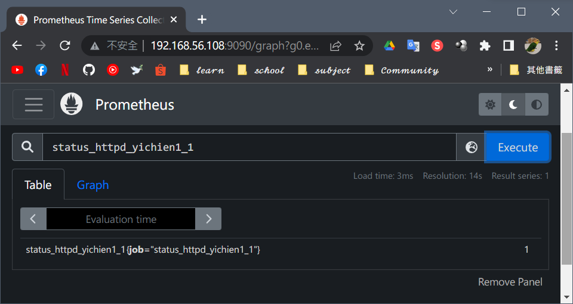
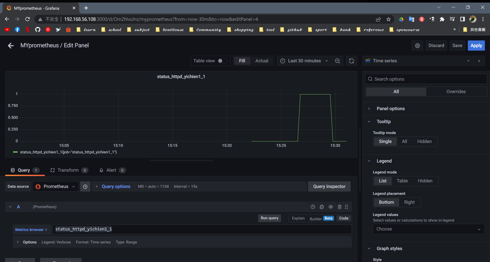
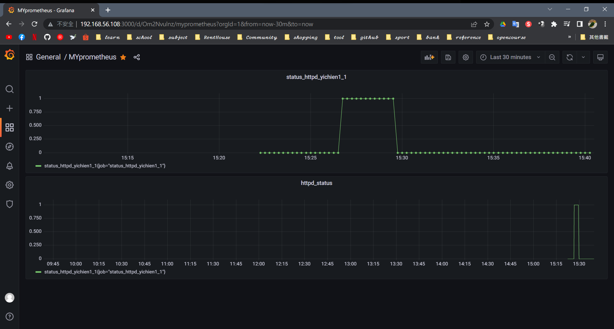
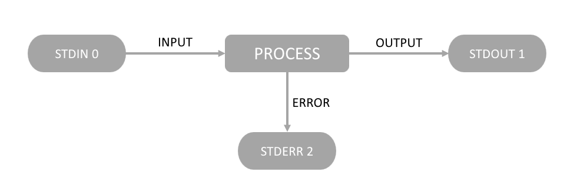

# 📝 Linux系統自動化運維第十二週筆記20220511
# 📖 PUSHGATEWAY 監控
## 🔖 METRIC 監控
### 👉 範例程式
```
echo "some_metric 9.99" | curl --data-binary @- http://192.168.56.108:9091/metrics/job/some_job
```
### 👉 使用腳本監控 (tcp_waiting_connection)
```
01 # mkdir -p /app/scripts/pushgateway
02 # gedit  /app/scripts/pushgateway/gedit tcp_waiting_connection.sh
    #!/bin/bash
    # For waiting connections
    label="count_netstat_wait_connetions"
    count_netstat_wait_connetions=`netstat -an | grep -i wait | wc -l`
    echo "$label:$count_netstat_wait_connetions"
    echo "$label $count_netstat_wait_connetions" | curl --data-binary @- http://192.168.56.108:9091/metrics/job/pushgateway/instance/$instance_name
03 # chmod +x /app/scripts/pushgateway/tcp_waiting_connection.sh
04 # ./tcp_waiting_connection.sh
    count_netstat_wait_connetions:0
```
* 成果

### 👉 使用腳本監控 (check_httpd_yichien1-1)
```
05 # gedit /app/scripts/pushgateway/check_httpd_yichien1-1.sh 
    #!/bin/bash
    # For check_httpd_yichien1-1
    label="status_httpd_yichien1_1"     //不能出現"-"會出錯
    curl -q /dev/null http://192.168.56.108 >/dev/null 2>&1   //-q:安靜模式
    status=`echo $?`     //判斷前面是否有誤(1:錯誤 0:正確)
    if [ $status -eq 0 ];then
        result=1
    else
        result=0
    fi
    echo "$label:$result"
    echo "$label $result" | curl --data-binary @- http://192.168.56.108:9091/metrics/job/$label
06 # chmod +x /app/scripts/pushgateway/check_httpd_yichien1-1.sh 
07 # ./check_httpd_yichien1-1.sh 
    status_httpd_yichien1_1:0
08 # systemctl start httpd
09 # ./check_httpd_yichien1-1.sh 
    status_httpd_yichien1_1:1
```
* 成果 - httpd 關閉

* 成果 - httpd 開啟

### 👉 定時備份
```
10 # crontab -e 
    * * * * * /app/scripts/pushgateway/check_httpd_yichien1-1.sh 
    * * * * * sleep 15;/app/scripts/pushgateway/check_httpd_yichien1-1.sh
    * * * * * sleep 30;/app/scripts/pushgateway/check_httpd_yichien1-1.sh
    * * * * * sleep 45;/app/scripts/pushgateway/check_httpd_yichien1-1.sh
11 # crontab -l     //查看備份排程
    * * * * * /app/scripts/pushgateway/check_httpd_yichien1-1.sh 
    * * * * * sleep 15;/app/scripts/pushgateway/check_httpd_yichien1-1.sh
    * * * * * sleep 30;/app/scripts/pushgateway/check_httpd_yichien1-1.sh
    * * * * * sleep 45;/app/scripts/pushgateway/check_httpd_yichien1-1.sh
```
## 🔖 GRAFANA DASHBOARD 監控
1. New Dashboard -> Add a new panel
2. 在下方的 Metrics browser 選擇要查看的項目 
3. 按下 Run query 後，上方即可顯示數據

4. Apply -> Save dashboard


# 📖 指令解析
#### 📍 EX. `whatis` : 特定命令的簡短描述讀檔
```
12 # whatis read
    read (1)             - bash built-in commands, see bash(1)
    read (1p)            - read a line from standard input
    read (2)             - read from a file descriptor
    read (3p)            - read from a file
13 # whatis cat
    cat (1)              - concatenate files and print on the standard output
    cat (1p)             - concatenate and print files
```
#### 📍 EX. `cat`
> DESCRIPTION　<br>
> Concatenate FILE(s), or standard input, to standard output.
* 打開一般檔案讀取並顯示出來
```
14 # cat /etc/hosts
    127.0.0.1   localhost localhost.localdomain localhost4 localhost4.localdomain4
    ::1         localhost localhost.localdomain localhost6 localhost6.localdomain6

    192.168.56.108 yichien1-1
    192.168.56.109 yichien1-2
    192.168.56.110 yichien1-3
```
* 把檔案導向到標準輸入並讀取標準輸入
```
15 # cat </etc/hosts    (cat 0</etc/hosts)
    127.0.0.1   localhost localhost.localdomain localhost4 localhost4.localdomain4
    ::1         localhost localhost.localdomain localhost6 localhost6.localdomain6

    192.168.56.108 yichien1-1
    192.168.56.109 yichien1-2
    192.168.56.110 yichien1-3
```
#### 📍 EX. `read` 
* 讀取標準輸入
```
16 # read -p "what is your name:" name
    what is your name:yichien
17 # echo $name
    yichien
```
#### 📍 EX. `EOF` : End Of File的縮寫，在文字的最後存在此字元表示資料結束
* 讀取多行標準輸入
```
18 # cat <<EOF
    > hello
    > world
    > EOF
    hello
    world
``` 
* 多行標準輸入後重新定義位置
```
19 # cat <<EOF > /tmp/a.txt
    > hello
    > world
    > 123
    > 456
    > 789
    > EOF
20 # cat /tmp/a.txt 
    hello
    world
    123
    456
    789
```
* 把字串丟到標準輸出後重新定義位置
```
21 # cat <<< "hi" >/tmp/a.txt 
22 # cat <<< "hi"
    hi
```
* `/dev/pts/0` : 標準輸入(stdin 0) 標準輸出(stdout 1) 標準錯誤(stderr 2)

```
23 # ls -l /proc/self/fd
    total 0
    lrwx------ 1 root root 64 May 16 16:14 0 -> /dev/pts/0
    lrwx------ 1 root root 64 May 16 16:14 1 -> /dev/pts/0
    lrwx------ 1 root root 64 May 16 16:14 2 -> /dev/pts/0
    lr-x------ 1 root root 64 May 16 16:14 3 -> /proc/15589/fd
```
#### 📍 EX. `touch` 
* 兩層式建立檔案
```
24 # touch {a..c}{1..5}.txt
25 # ls
    a       a2.txt  a4.txt  b1.txt  b3.txt  b5.txt  c2.txt  c4.txt  hello.txt
    a1.txt  a3.txt  a5.txt  b2.txt  b4.txt  c1.txt  c3.txt  c5.txt  test
```
* 額外echo進原檔案
```
26 # echo "1" >> 1.txt
27 # echo "2" >> 1.txt
28 # echo "3" >> 1.txt
29 # cat 1.txt 
    1
    2
    3
```
* 調用子進程
```
30 # exec > 2.txt
31 # echo "1"
32 # echo "2"
33 # echo "3"
34 # exec > /dev/pts/0     //回復進程
35 # cat 2.txt 
    1
    2
    3
```
#### 📍 EX. `grep` 
* 正則表達式
```
36 # ps -ef | grep prometheus
    root      6506     1  0 15:21 ?        00:00:38 /opt/module/prometheus/prometheus --config.file=/opt/module/prometheus/prometheus.yml --storage.tsdb.path=/opt/module/prometheus/data --storage.tsdb.retention=30d --web.enable-lifecycle --log.level=debug
    root     18507  3239  0 21:56 pts/0    00:00:00 grep --color=auto prometheus
37 # ps -ef | grep prometheus | grep -v grep     //-v : 排除在外
    root      6506     1  0 15:21 ?        00:00:38 /opt/module/prometheus/prometheus --config.file=/opt/module/prometheus/prometheus.yml --storage.tsdb.path=/opt/module/prometheus/data --storage.tsdb.retention=30d --web.enable-lifecycle --log.level=debug
38 # ps -ef | grep prometheu[s]
    root      6506     1  0 15:21 ?        00:00:37 /opt/module/prometheus/prometheus --config.file=/opt/module/prometheus/prometheus.yml --storage.tsdb.path=/opt/module/prometheus/data --storage.tsdb.retention=30d --web.enable-lifecycle --log.level=debug
39 # ps -ef | grep [p]rometheus
    root      6506     1  0 15:21 ?        00:00:37 /opt/module/prometheus/prometheus --config.file=/opt/module/prometheus/prometheus.yml --storage.tsdb.path=/opt/module/prometheus/data --storage.tsdb.retention=30d --web.enable-lifecycle --log.level=debug
```

## 📖 補充資料
* [【prometheus系列】7、pushgateway自定义脚本采集监控数据](https://blog.51cto.com/root/3033785)
* [Prometheus 介紹與基礎入門 (上)](https://www.inwinstack.com/zh/blog-tw/blog_other-tw/2156/)
* [Exec - Linux命令 - UNIX命令](https://zhtw.eyewated.com/exec-linux%E5%91%BD%E4%BB%A4-unix%E5%91%BD%E4%BB%A4/)


🖊️ editor : yi-chien Liu