# 📝 Linux系統自動化運維第十二週筆記20220504
# 📖 PROMETHEUS
## 🔖 GRAPH (http:// `IP` :9090/graph)
* `up {job = "node_exporter2"}`
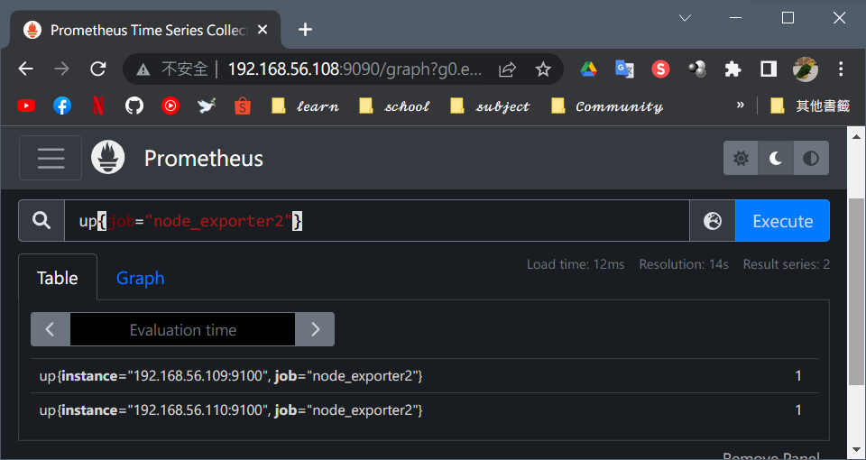
* `up {job != "node_exporter2"}`
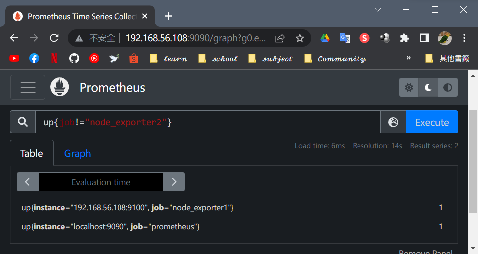
* `up {instance =~ "192.168.56.*"}`
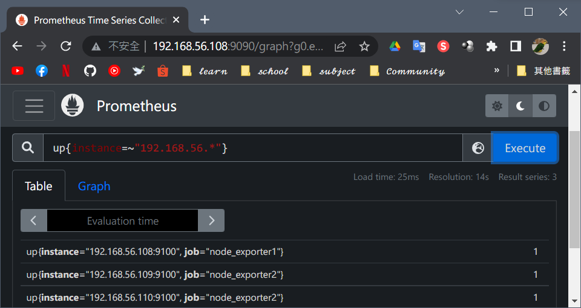
* `up {instance !~ "192.168.56.*"}`
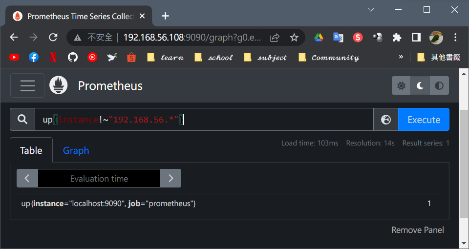
## 🔖 NODE_LOAD (平均附載量)
* `node_load1 {instance="192.168.56.108:9100"} [1m]`
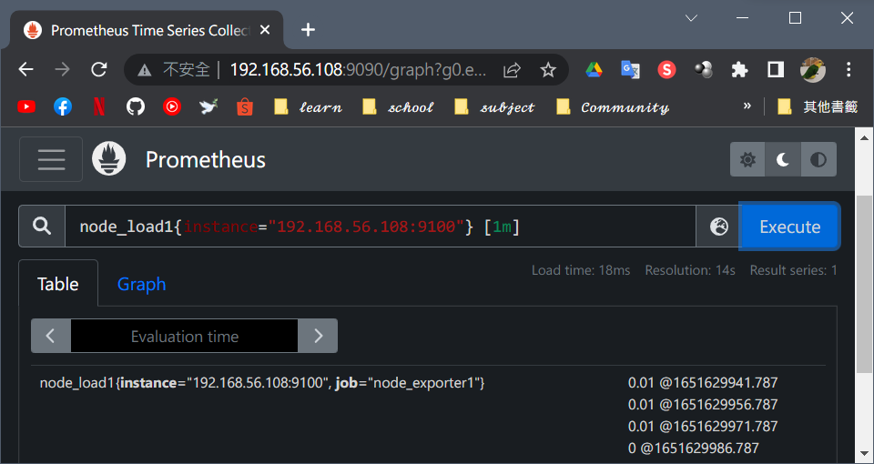
* `node_load1 {instance="192.168.56.108:9100"} offset 5m`
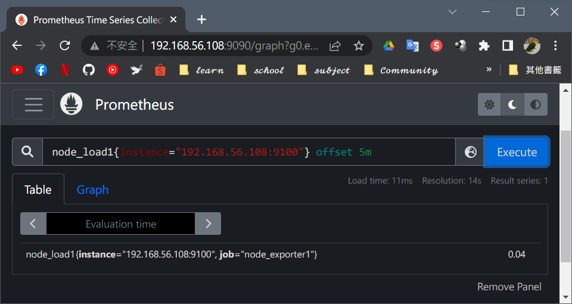
* `node_load1 {instance="192.168.56.108:9100"} [1m] offset 5m`
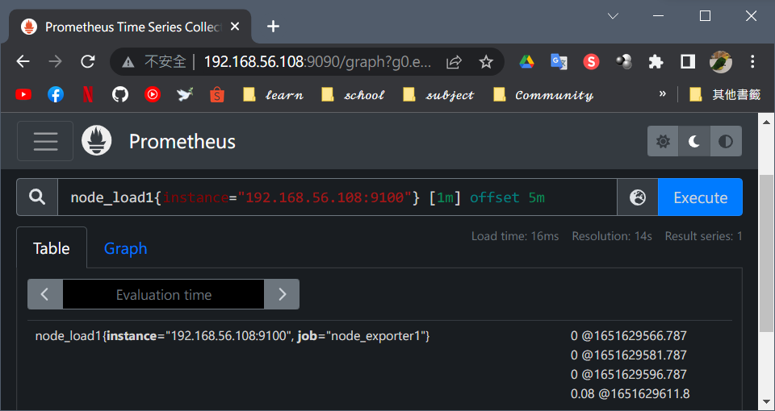

## 🔖 CPU 使用率
* increase 的意思是表示增量
1. cpu0 5分鐘內處於空閒狀態的時間： <br>
`increase(node_cpu_seconds_total{cpu="0",mode="idle"}[5m])` <br>
  (node_cpu_seconds_total 是單調遞增的，這個公式的結果是當前時點的 node_cpu_seconds_total 減去5分鐘之前的 node_cpu_seconds_total，也就是這5分鐘之內處於idle 狀態的 cpu 時間)
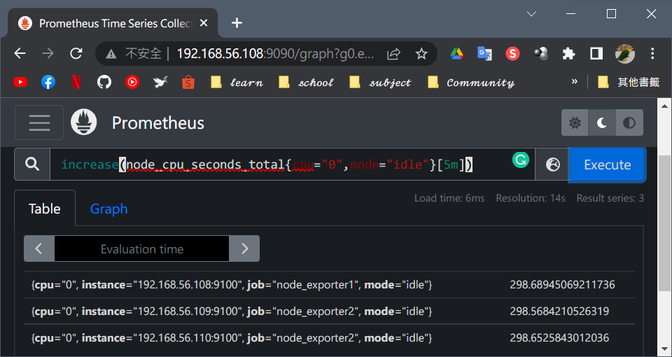
2. cpu0 5分鐘內處於空閒狀態的時間佔比： <br>
`increase(node_cpu_seconds_total{cpu="0",mode="idle"}[5m]) / increase(node_cpu_seconds_total{cpu="0"}[5m])` <br>
  (分母其實就是5分鐘=300秒)
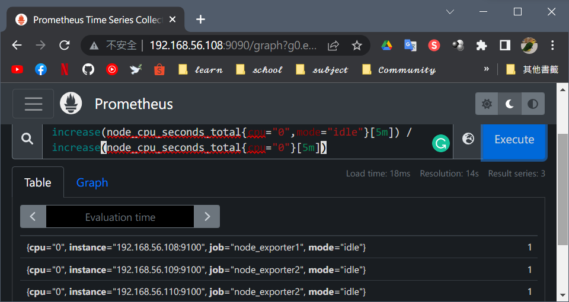
3. 一台主機所有 cpu 5分鐘內處於空閒狀態的時間佔比，用 sum() 函數累加各核數值： <br>
`sum (increase(node_cpu_seconds_total{mode="idle"}[5m])) / sum (increase(node_cpu_seconds_total{mode="idle"}[5m]))`
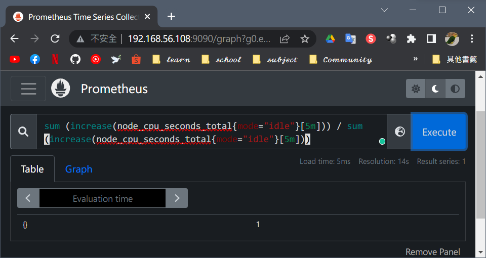
4. 如果 Prometheus 監控多台主機，要根據每台主機做 sum： <br>
`sum by (instance)(increase(node_cpu_seconds_total{mode="idle"}[5m])) / sum by (instance)(increase(node_cpu_seconds_total[5m]))`
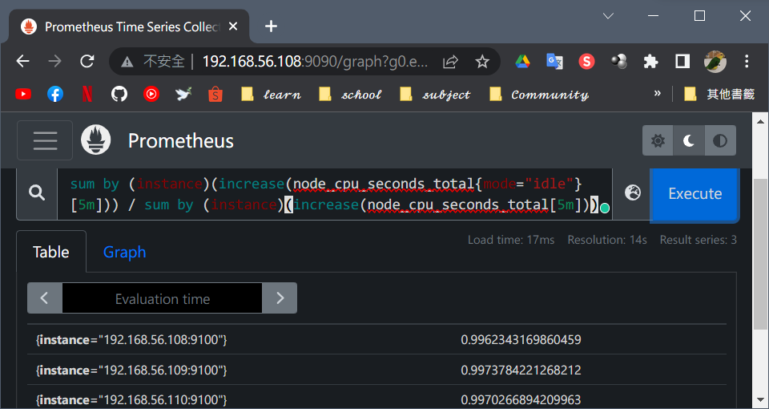
5. cpu 使用率 :  <br>
`1 - cpu 空闲率：100 * (1 - sum by (instance)(increase(node_cpu_seconds_total{mode="idle"}[5m])) / sum by (instance)(increase(node_cpu_seconds_total[5m])))`
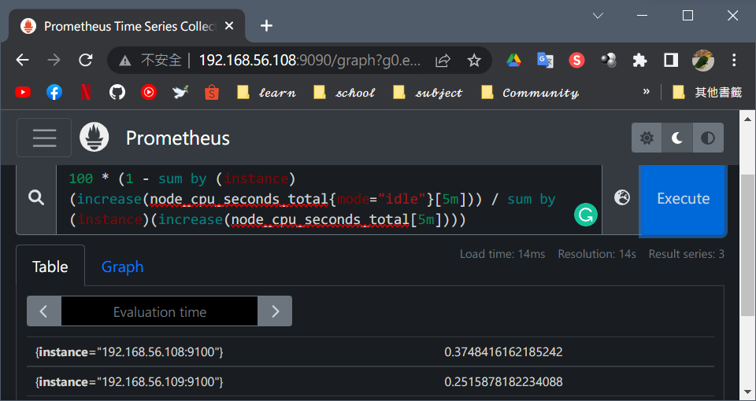
## 🔖 內存使用率
1. node_memory_MemTotal_bytes - 主機上的總內存
2. node_memory_MemFree_bytes - 主機上的空閒內存
3. node_memory_Buffers_bytes_bytes - 緩衝區緩存中的內存
4. node_memory_Cached_bytes_bytes - 頁面緩存中的內存
`(node_memory_MemTotal_bytes-(node_memory_MemFree_bytes+ node_memory_Cached_bytes + node_memory_Buffers_bytes)) / node_memory_MemTotal_bytes * 100`
`(node_filesystem_size_bytes{mountpoint="/boot"} - node_filesystem_free_bytes{mountpoint="/boot"}) / node_filesystem_size_bytes{mountpoint="/boot"} * 100`


# 📖 GRAFANA
## 🔖 安裝
```
01 # gedit /etc/yum.repos.d/grafana.repo
    [grafana]
    name = grafana
    baseurl = https://packages.grafana.com/oss/rpm
    repo_gpgcheck = 1
    enabled = 1
    gpgcheck = 1
    gpgkey = http://packages.grafana.com/gpg.key
    sslverify = 1
    sslcacert = /etc/pki/tls/certs/ca-bundle.crt
02 # yum install grafana
03 # systemctl daemon-reload
04 # systemctl start grafana-server
05 # systemctl status grafana-server
    ● grafana-server.service - Grafana instance
      Loaded: loaded (/usr/lib/systemd/system/grafana-server.service; disabled; vendor preset: disabled)
      Active: active (running) since Wed 2022-05-04 11:17:14 PST; 3s ago
```
### 👉 第一步 : 開啟網頁
* http:// `IP` :3000

### 👉 第二步 : 新增 Data Source (prometheus)
* HTTP的URL : http:// `IP` :9090
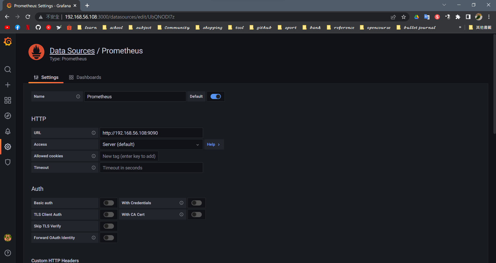
### 👉 第三步 : 打開 GRAFANA 官網選擇 DASHBOARD
1. 點選 Products -> Dashboards
2. Data Source 選擇 Prometheus
3. 選擇 Node Exporter Full

4. Copy ID 或者是 Download JSON

### 👉 第四步 : 在 `http:// `IP` :3000` IMPORT
1. Create -> Import
2. 貼上 ID or JSON
3. 點選 Import

### 👉 第五步 : 查看 Dashboards
* 將 SERVER & CLIENT 開啟即可查看
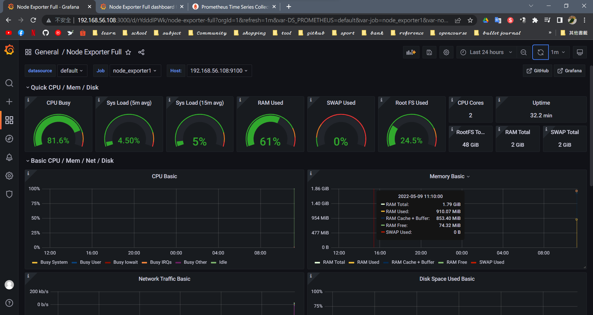

# 📖 PUSHGATEWAY
```
06 # wget https://github.com/prometheus/pushgateway/releases/download/v1.4.2/pushgateway-1.4.2.linux-amd64.tar.gz
07 # tar xf pushgateway-1.4.2.linux-amd64.tar.gz -C /opt/module
08 # chown -R prometheus:prometheus /opt/module/pushgateway/
09 # mv pushgateway-1.4.2.linux-amd64/ pushgateway
10 # gedit /usr/lib/systemd/system/pushgateway.service
    [Unit]
    Description=pushgateway
    After=network.target

    [Service]
    Type=simple
    ExecStart=/opt/module/pushgateway/pushgateway 
    Restart=on-failure

    [Install]
    WantedBy=multi-user.target
11 # gedit /opt/module/prometheus/prometheus.yml 
    static_configs:
        - targets: ["localhost:9090"]

    - job_name: "node_exporter1"
      static_configs:
        - targets: ["192.168.56.108:9100"]

    - job_name: "node_exporter2"
      static_configs:
        - targets: ["192.168.56.109:9100","192.168.56.110:9100"]

    - job_name: 'pushgateway'
      honor_labels: true
      static_configs:
        - targets: ['192.168.56.108:9091']
12 # systemctl daemon-reload
13 # systemctl start pushgateway
14 # systemctl status pushgateway
```
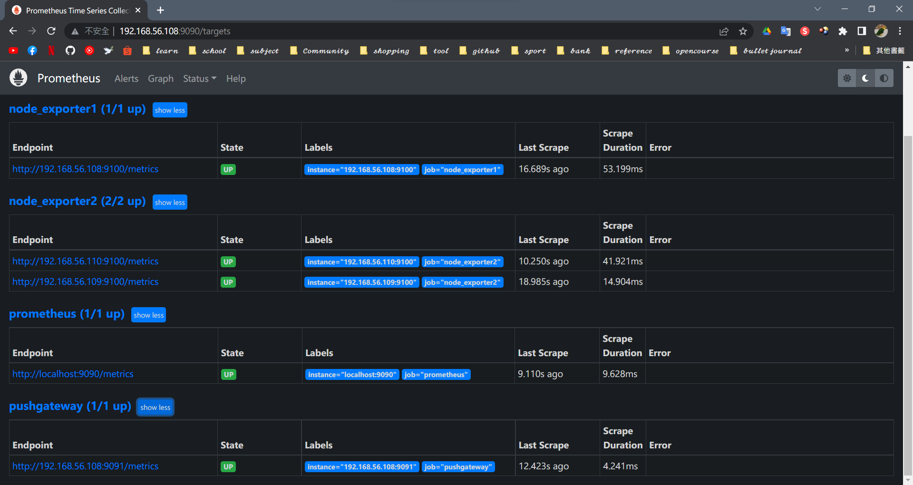

## 📖 補充資料
* [Metrics类型](https://yunlzheng.gitbook.io/prometheus-book/parti-prometheus-ji-chu/promql/prometheus-metrics-types)
* [Prometheus 查询语言 PromQL 的 CPU 使用率计算方法](https://blog.csdn.net/qq_35753140/article/details/105121525)
* [Prometheus 监控 CPU,Memory,Disk](https://www.modb.pro/db/43636)
* [在 CentOS 7 上安裝 Grafana 6.0.2](http://max043.blogspot.com/2019/03/centos-7-grafana-602.html)


🖊️ editor : yi-chien Liu


