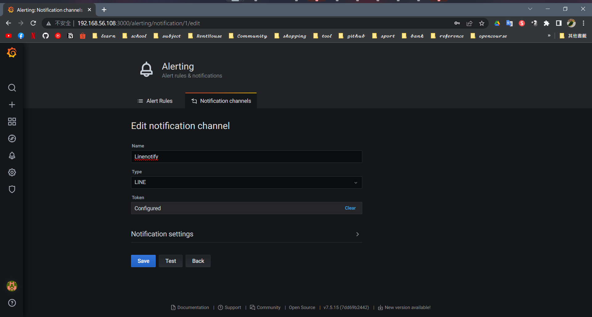
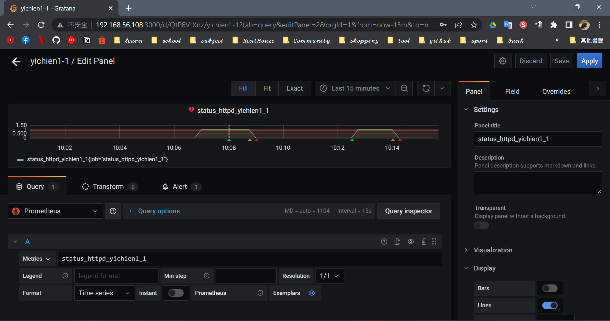
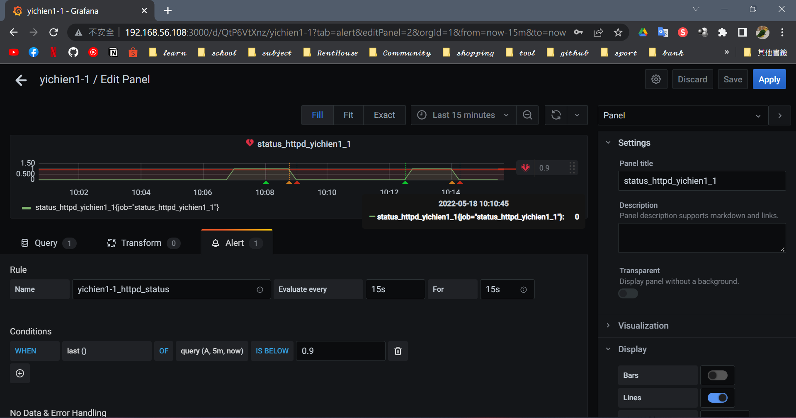
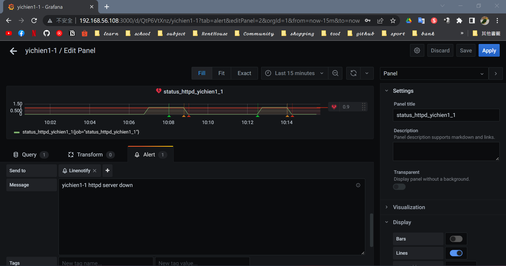

# 📝 Linux系統自動化運維第十三週筆記20220518
# 📖 GRAFANA ALERT
## 🔖 Docker 安裝 Grafana 
```
01 # systemctl start docker
02 # docker run -d --name=grafana -p 3000:3000 grafana/grafana:7.5.15
    Unable to find image 'grafana/grafana:7.5.15' locally
    Trying to pull repository docker.io/grafana/grafana ... 
    7.5.15: Pulling from docker.io/grafana/grafana
```
## 🔖 Line Notify 設定
1. Alerting -> Notification channels -> New channel
2. 在 [Line Notify](https://notify-bot.line.me/zh_TW/) 發行權杖
3. 加入權杖到 Grafana

## 🔖 Grafana 設定
1. Metrics 選擇監控指令

2. 設定 Dashboard 的 Alert 條件
    > `WHEN last () OF query (A, 5m, now) IS BELOW 0.9`

3. 選擇 Send to 選擇 linenotify

## 🔖 測試結果
* 收到 linenotify 訊息

# 📖 ANSIBLE
## 🔖 Ansible 安裝
```
03 # yum install epel-release -y
04 # yum install ansible
```
## 🔖 Ansible 配置
```
05 # gedit /etc/ansible/hosts
    [server1]
    192.168.56.109
    [server2]
    192.168.56.110
    [servers]
    192.168.56.109
    192.168.56.110
```
## 🔖 SSH 金鑰設定
```
06 # ssh-keygen
07 # ssh-copy-id root@192.168.56.109
08 # ssh-copy-id root@192.168.56.110
```
## 🔖 開啟 SSHD (192.168.56.109 / 192.168.56.110)
```
09 systemctl start sshd
```
## 🔖 測試主機的連通性
```
10 # ansible server1 -m ping
    192.168.56.109 | SUCCESS => {
        "ansible_facts": {
            "discovered_interpreter_python": "/usr/bin/python"
        }, 
        "changed": false, 
        "ping": "pong"
    }
11 # ansible server2 -m ping
    192.168.56.110 | SUCCESS => {
        "ansible_facts": {
            "discovered_interpreter_python": "/usr/bin/python"
        }, 
        "changed": false, 
        "ping": "pong"
    }
12 # ansible servers -m ping
    192.168.56.110 | SUCCESS => {
        "ansible_facts": {
            "discovered_interpreter_python": "/usr/bin/python"
        }, 
        "changed": false, 
        "ping": "pong"
    }
    192.168.56.109 | SUCCESS => {
        "ansible_facts": {
            "discovered_interpreter_python": "/usr/bin/python"
        }, 
        "changed": false, 
        "ping": "pong"
    }
```
## 🔖 檢視 IP
```
13 # ansible all --list
    hosts (2):
        192.168.56.109
        192.168.56.110
```
## 🔖 檢查節點的記憶體情況 (command是預設可以省略)
```
14 # ansible servers -m command -a "free -m " 
    192.168.56.109 | CHANGED | rc=0 >>
                 total        used        free      shared  buff/cache   available
    Mem:           1837         642         548          16         646        1031
    Swap:          2047           0        2047
    192.168.56.110 | CHANGED | rc=0 >>
                total        used        free      shared  buff/cache   available
    Mem:           1837         804         320          16         712         833
    Swap:          2047           0        2047
```
## 🔖 查詢系統負載資訊
```
15 # ansible servers -m command -a "uptime"
    192.168.56.109 | CHANGED | rc=0 >>
    16:21:29 up 28 min,  3 users,  load average: 0.00, 0.01, 0.13
    192.168.56.110 | CHANGED | rc=0 >>
    16:21:28 up 28 min,  3 users,  load average: 0.01, 0.07, 0.14
```
## 🔖 遠端指令
```
16 # ansible server1 -m command -a "cd /home/user" & "ls"      //單行
    [1] 15520
    2.txt  Desktop	Documents  Downloads  Music  Pictures  Public  Templates  testdir  Videos
17 # ansible server1 -m shell -a "cd /home/user; ls"      //可多行
    192.168.56.109 | CHANGED | rc=0 >>
    Desktop
    Documents
    Downloads
    Music
    Pictures
    Public
    Templates
    testdir
    Videos
```

## 📖 補充資料
* [太厲害了，終於有人能把Ansible講的明明白白了，建議收藏](https://tw511.com/a/01/32123.html)


🖊️ editor : yi-chien Liu