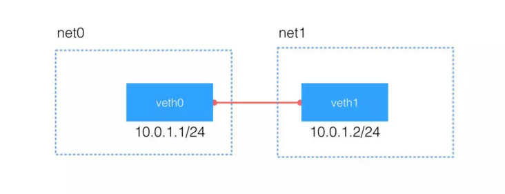
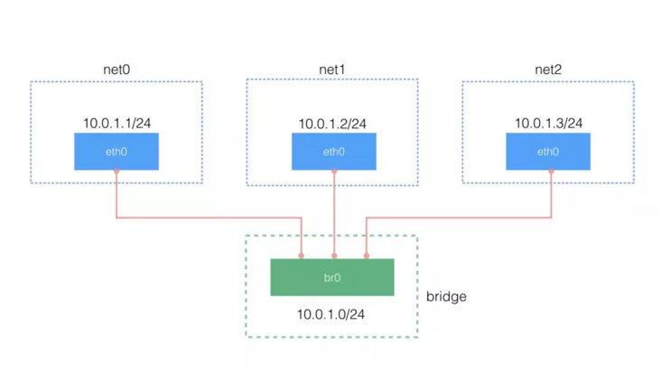

# 📝 Linux系統自動化運維第三週筆記20220302
# 📖 Network Namespace
* 操作子命令 `ip netns`
## 🔖 兩個 namespace 間的通信

### 👉 創建 namespace
```
01 # ip netns add net1
02 # ip netns add net0
03 # ip netns ls
    net0
    net1
```
### 👉 創建 veth pair
```
04 # ip link add type veth
05 # ifconfig -a
    veth0: flags=4098<BROADCAST,MULTICAST>  mtu 1500
            ether da:f0:ba:82:7d:c9  txqueuelen 1000  (Ethernet)
            RX packets 0  bytes 0 (0.0 B)
            RX errors 0  dropped 0  overruns 0  frame 0
            TX packets 0  bytes 0 (0.0 B)
            TX errors 0  dropped 0 overruns 0  carrier 0  collisions 0

    veth1: flags=4098<BROADCAST,MULTICAST>  mtu 1500
            ether 1a:9b:9e:14:c7:b2  txqueuelen 1000  (Ethernet)
            RX packets 0  bytes 0 (0.0 B)
            RX errors 0  dropped 0  overruns 0  frame 0
            TX packets 0  bytes 0 (0.0 B)
            TX errors 0  dropped 0 overruns 0  carrier 0  collisions 0
```
### 👉 將 veth 加入到 namespace 中
```
06 # ip link set dev veth0 netns net0
07 # ip link set dev veth1 netns net1
08 # ip netns exec net0 ifconfig -a
    lo: flags=8<LOOPBACK>  mtu 65536
            loop  txqueuelen 1000  (Local Loopback)
            RX packets 0  bytes 0 (0.0 B)
            RX errors 0  dropped 0  overruns 0  frame 0
            TX packets 0  bytes 0 (0.0 B)
            TX errors 0  dropped 0 overruns 0  carrier 0  collisions 0

    veth0: flags=4098<BROADCAST,MULTICAST>  mtu 1500
            ether da:f0:ba:82:7d:c9  txqueuelen 1000  (Ethernet)
            RX packets 0  bytes 0 (0.0 B)
            RX errors 0  dropped 0  overruns 0  frame 0
            TX packets 0  bytes 0 (0.0 B)
            TX errors 0  dropped 0 overruns 0  carrier 0  collisions 0
```
### 👉 給 veth pair 配上 ip 地址
```
09 # ip netns exec net0 ip link set dev veth0 name eth0
10 # ip netns exec net0 ip addr add 10.0.1.1/24 brd + dev eth0
11 # ip netns exec net0 ifconfig eth0 up
12 # ip netns exec net1 ip link set dev veth1 name eth0
13 # ip netns exec net1 ip addr add 10.0.1.2/24 brd + dev eth0
14 # ip netns exec net1 ifconfig eth0 up
```
### 👉 用 ping 測試連通性
#### 📍 Centos01 
```
15 # ip netns exec net0 ping 10.0.1.2
        PING 10.0.1.2 (10.0.1.2) 56(84) bytes of data.
        64 bytes from 10.0.1.2: icmp_seq=1 ttl=64 time=0.033 ms
        64 bytes from 10.0.1.2: icmp_seq=2 ttl=64 time=0.069 ms
        64 bytes from 10.0.1.2: icmp_seq=3 ttl=64 time=0.087 ms
17 # ip netns exec net0 curl http://10.0.1.2/hi.htm
        hi
```
#### 📍 Centos02
```
16 # ip netns exec net1 echo "hi" > hi.htm
18 # ip netns exec net1 python -m SimpleHTTPServer 80
        Serving HTTP on 0.0.0.0 port 80 ...
        10.0.1.1 - - [01/Mar/2022 20:49:12] "GET /hi.htm HTTP/1.1" 200 -
```
## 🔖 多個不同 namespace 間的通信

### 👉 創建 namespace
```
01 # ip netns add net0
02 # ip netns add net1
03 # ip netns add net2
04 # ip netns ls
    net0
    net1
    net2
```
### 👉 創建 veth pair
```
05 # ip link add type veth
06 # ip link add type veth
07 # ip link add type veth
```
### 👉 將 veth 加入到 namespace 中
```
08 # ip link set veth1 netns net0
09 # ip link set veth3 netns net1
10 # ip link set veth5 netns net2
```
### 👉 將 veth pair 一邊掛在 namespace 上，一邊掛在bridge上 ，再設ip地址
```
(1) 配置第一個 net0
11 # ip netns exec net0 ip link set dev veth1 name eth0
12 # ip netns exec net0 ip addr add 10.0.1.1/24 dev eth0
13 # ip netns exec net0 ip link set dev eth0 up
14 # ip link set dev veth0 up

(2) 配置第二個 net1
15 # ip netns exec net1 ip link set dev veth3 name eth0
16 # ip netns exec net1 ip addr add 10.0.1.2/24 dev eth0
17 # ip netns exec net1 ip link set dev eth0 up
18 # ip link set dev veth2 up

(3) 配置第三個 net2
19 # ip netns exec net2 ip link set dev veth5 name eth0
20 # ip netns exec net2 ip addr add 10.0.1.3/24 dev eth0
21 # ip netns exec net2 ip link set dev eth0 up
22 # ip link set dev veth4 up

```
# 📖 Linux Bridge
## 🔖 安裝步驟
```
01 # yum install bridge-utils
```
### 👉 新建 bridge `brctl addbr <bridge>`
```
02 # brctl addbr br0
```
### 👉 新增裝置 (veth) 到 bridge `brctl addif <bridge> veth`
```
03 # brctl addif br0 veth0
04 # brctl addif br0 veth2
05 # brctl addif br0 veth4
```
### 👉 顯示當前 bridge 及其所連線的網路埠 `brctl show`
```
06 # brctl show br0
        bridge name	bridge id		STP enabled	interfaces
        br0		8000.56c6b40c49a5	no		veth0
                                                                veth2
                                                                veth4
```
### 👉 啟動 bridge 
```
07 # ifconfig br0 up
08 # ifconfig veth0 up
09 # ifconfig veth2 up
10 # ifconfig veth4 up
```
### 👉 測試網路連通性
```
11 # ip netns exec net0 ping 10.0.1.2
        PING 10.0.1.2 (10.0.1.2) 56(84) bytes of data.
        64 bytes from 10.0.1.2: icmp_seq=1 ttl=64 time=0.073 ms
        64 bytes from 10.0.1.2: icmp_seq=2 ttl=64 time=0.074 ms
        ^C
        --- 10.0.1.2 ping statistics ---
        2 packets transmitted, 2 received, 0% packet loss, time 1000ms
        rtt min/avg/max/mdev = 0.073/0.073/0.074/0.008 ms
12 # ip addr add 10.0.1.254/24 brd + dev br0
```
# 📖 Docker
## 🔖 基本概念

* 映像檔（Image）
  * Docker 映像檔就是一個唯讀的模板
  * 映像檔可以用來建立 Docker 容器
* 容器（Container）
  * 容器是從映像檔建立的執行實例
  * Docker 利用容器來執行應用
  * 可以被啟動、開始、停止、刪除
  * 每個容器都是相互隔離的、保證安全的平台
* 倉庫（Repository）
  * 倉庫是集中存放映像檔檔案的場所
  * 每個倉庫中又包含了多個映像檔
  * 每個映像檔有不同的標籤（tag）
  * 倉庫分為公開倉庫（Public）和私有倉庫（Private）兩種形式
## 🔖 安裝步驟
```
01 # yum install -y yum-utils
02 # sudo yum-config-manager --add-repo https://download.docker.com/linux/centos/docker-ce.repo
03 # sudo yum install docker-ce docker-ce-cli containerd.io
```
## 🔖 Image 映像檔常用指令
指令 | 說明 | 範例
---- | ---- | ----
search | 搜尋 | docker search centos
pull | 下載 | docker pull centos
images | 列表 | docker images
run | 執行 | docker run -it ubuntu echo "hi"
build | 建立 | docker build -t member:1 .
login | 登入 | docker login docker.okborn.com
push | 上傳 | 	docker push
### 👉 使用範例
```
04 # docker images
REPOSITORY    TAG       IMAGE ID       CREATED        SIZE
ubuntu        latest    54c9d81cbb44   4 weeks ago    72.8MB
hello-world   latest    feb5d9fea6a5   5 months ago   13.3kB
05 # docker run -it ubuntu echo "hi"
hi
```
## 📖 補充資料
* [详解云计算网络底层技术——Linux network namespace 原理与实践](https://segmentfault.com/a/1190000018391069)


🖊️ editor : yi-chien Liu

