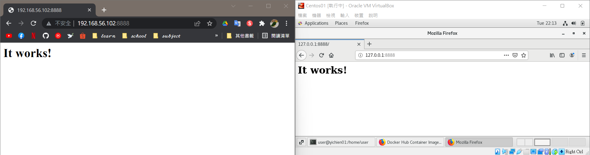
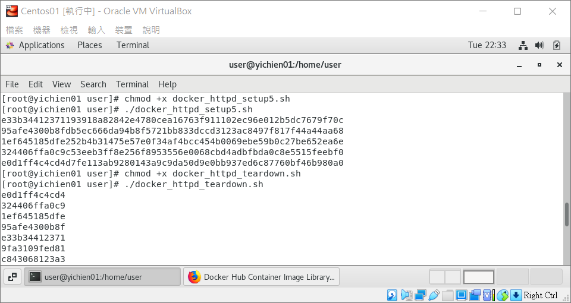

# 📝 Linux系統自動化運維第四週筆記20220309
# 📖 Docker
* 容器主要靠 LXC 與 aufs 等Linux 技術達成
* LXC : 
  * 利用 Kernel namespaces 達到在核心中隔離多個空間
  * 用隔離空間可讓一個主要核心執行多套不同的 Linux 核心
* AHFS : 
  * advanced multi-layered unification filesystem
  * 檔案系統的更動採用分層疊架的方式
  * 更動檔案系統後，這個變動就成為一層
  * 每一層只記錄與上一層的差異

### 👉 範例 : 關閉後開啟不會有紀錄
```
01 # docker run -it ubuntu bash
    root@37138e185aa6:/# cd /home
    root@37138e185aa6:/home# ls
    root@37138e185aa6:/home# echo "hi" > hi.txt
    root@37138e185aa6:/home# cat hi.txt 
    hi
    root@37138e185aa6:/home# exit
    exit
02 # docker run -it ubuntu bash
    root@dac47b581a97:/# cd /home/
    root@dac47b581a97:/home# ls
    root@dac47b581a97:/home#
```
### 👉 儲存狀態 `ctrl+p+q`   
```
root@dac47b581a97:/home#    (ctrl+p+q)
03 # docker ps
    CONTAINER ID   IMAGE     COMMAND   CREATED         STATUS         PORTS     NAMES
    dac47b581a97   ubuntu    "bash"    3 minutes ago   Up 3 minutes             gifted_neumann
```
### 👉 創建鏡像 `docker commit [OPTIONS] CONTAINER [REPOSITORY[:TAG]]`
```
# docker ps
    CONTAINER ID   IMAGE     COMMAND   CREATED         STATUS         PORTS     NAMES
    dac47b581a97   ubuntu    "bash"    3 minutes ago   Up 3 minutes             gifted_neumann
# docker commit dac ubuntu:v1
    sha256:061c6bd2c753ad259923236d93700808bc3834ac2246806b5722aa92a2d4d772
# docker images
    REPOSITORY    TAG       IMAGE ID       CREATED         SIZE
    ubuntu        v1        061c6bd2c753   6 seconds ago   72.8MB
    ubuntu        latest    54c9d81cbb44   4 weeks ago     72.8MB
    hello-world   latest    feb5d9fea6a5   5 months ago    13.3kB
```
### 👉 回到鏡像離開 `docker attach CONTAINER `
```    
04 # docker attach dac  
    root@dac47b581a97:/home# exit
    exit
05 # docker run -it ubuntu:v1 bash
    root@e4b1f29ae80e:/# cd /home/
    root@e4b1f29ae80e:/home# ls
    hi.txt
    root@e4b1f29ae80e:/home# cat hi.txt 
    hi
```
### 👉 同個docker開雙視窗執行不同指令 `docker exec -it CONTAINER sh`
```
06 # docker exec -it 1e0 sh
```
### 👉 刪除鏡像
```
07 # docker ps
    CONTAINER ID   IMAGE     COMMAND   CREATED          STATUS         PORTS     NAMES
    d7fe183bb87a   busybox   "sh"      10 seconds ago   Up 8 seconds             jolly_montalcini
08 # docker stop d7f
    d7f
09 # docker ps
    CONTAINER ID   IMAGE     COMMAND   CREATED   STATUS    PORTS     NAMES
10 # docker ps
    CONTAINER ID   IMAGE     COMMAND   CREATED         STATUS         PORTS     NAMES
    910f0a89df3b   busybox   "sh"      9 seconds ago   Up 8 seconds             relaxed_bardeen
11 # docker rm -f 910
    910
12 # docker ps
    CONTAINER ID   IMAGE     COMMAND   CREATED   STATUS    PORTS     NAMES
```

### 👉 刪除所有鏡像
```
13 # docker ps
    CONTAINER ID   IMAGE     COMMAND   CREATED          STATUS          PORTS     NAMES
    032a0065aae5   busybox   "sh"      23 seconds ago   Up 21 seconds             xenodochial_varahamihira
    aeccc8a77d5c   busybox   "sh"      41 seconds ago   Up 39 seconds             fervent_burnell
    dde842e91604   busybox   "sh"      52 seconds ago   Up 51 seconds             sleepy_goldberg
14 # docker rm -f $(docker ps -a -q)
    032a0065aae5
    aeccc8a77d5c
    dde842e91604
```
### 👉 背景執行httpd
```
15 # docker run -d -p 8888:80 httpd
    9fa3109fed8100a9817a1d308431ea2f827e99e2542d473c112395bd0eccd269
```
* 可以開啟網頁確定運作

#### 📍 寫腳本 - gedit docker_httpd_setup5.sh
```
16 # cat docker_httpd_setup5.sh
    #!/usr/bin/bash

    for i in {1..5};
    do
        portno=`expr 9000 + $i`
        docker run -d -p $portno:80 httpd
    done 
```
* 執行
```
17 # chmod +x docker_httpd_setup5.sh 
18 # ./docker_httpd_setup5.sh 
    e33b34412371193918a82842e4780cea16763f911102ec96e012b5dc7679f70c
    95afe4300b8fdb5ec666da94b8f5721bb833dccd3123ac8497f817f44a44aa68
    1ef645185dfe252b4b31475e57e0f34af4bcc454b0069ebe59b0c27be652ea6e
    324406ffa0c9c53eeb3ff8e256f8953556e0068cbd4adbfbda0c8e5515feebf0
    e0d1ff4c4cd4d7fe113ab9280143a9c9da50d9e0bb937ed6c87760bf46b980a0
```
#### 📍 寫腳本 - gedit docker_httpd_teardown.sh 
```
19 # cat docker_httpd_teardown.sh 
    #!/usr/bin/bash

    docker rm -f $(docker ps -a -q)
```
* 執行
```
20 # chmod +x docker_httpd_teardown.sh 
21 # ./docker_httpd_teardown.sh 
    e0d1ff4c4cd4
    324406ffa0c9
    1ef645185dfe
    95afe4300b8f
    e33b34412371
    9fa3109fed81
    c843068123a3
```
* 成果


# 📖 Docker Hub
## 🔖 備份鏡像到docker hub
### 👉 在虛擬機上登入
```
22 # docker login
    Login with your Docker ID to push and pull images from Docker Hub. If you don't have a Docker ID, head over to https://hub.docker.com to create one.
    Username: yichien1019
    Password: 
    WARNING! Your password will be stored unencrypted in /root/.docker/config.json.
    Configure a credential helper to remove this warning. See
    https://docs.docker.com/engine/reference/commandline/login/#credentials-store

    Login Succeeded
```
### 👉 上傳 `docker push`
```
23 # docker tag 3c8 yichien1019/ubuntu:v1
24 # docker push yichien1019/ubuntu:v1
    The push refers to repository [docker.io/yichien1019/ubuntu]
    39411f2c1913: Pushed 
    36ffdceb4c77: Mounted from library/ubuntu 
    v1: digest: sha256:f8862cb38970d36bec062c1453c44cea55371084a732b501174aa4fe43d4c777 size: 736
```
### 👉 刪除 `docker rmi -f`
```
25 # docker rmi -f 3c8
    Untagged: ubuntu:v1
    Untagged: yichien1019/ubuntu:v1
    Untagged: yichien1019/ubuntu@sha256:f8862cb38970d36bec062c1453c44cea55371084a732b501174aa4fe43d4c777
    Deleted: sha256:3c88a4a782a81324a138165a4eb63ded85142d16dc9a462e0bd66ae0125d3c6b
    Deleted: sha256:d6afe0149bf3659f642e6a7c5e5298f0e2814521dcdbad341f0e46a85ad1aaee
```
### 👉 下載 `docker push`
```
26 # docker push yichien1019/ubuntu:v1
    The push refers to repository [docker.io/yichien1019/ubuntu]
    An image does not exist locally with the tag: yichien1019/ubuntu
27 # docker pull yichien1019/ubuntu:v1
    v1: Pulling from yichien1019/ubuntu
    08c01a0ec47e: Already exists 
    605c93f07e5f: Pull complete 
    Digest: sha256:f8862cb38970d36bec062c1453c44cea55371084a732b501174aa4fe43d4c777
    Status: Downloaded newer image for yichien1019/ubuntu:v1
    docker.io/yichien1019/ubuntu:v1
```

## 📖 補充資料
* [Docker Hub](https://hub.docker.com/)

🖊️ editor : yi-chien Liu