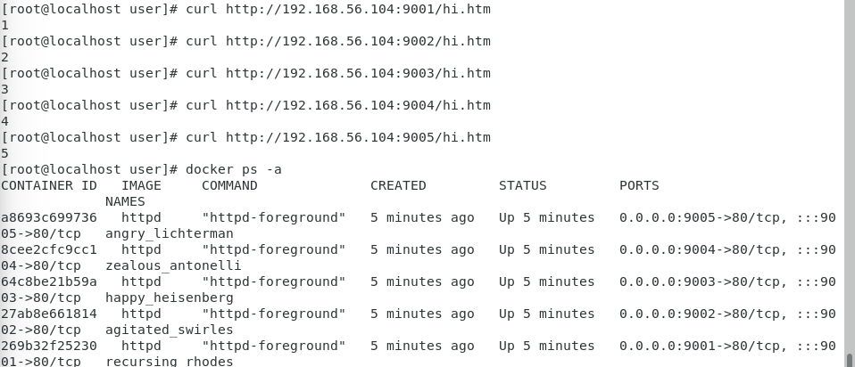
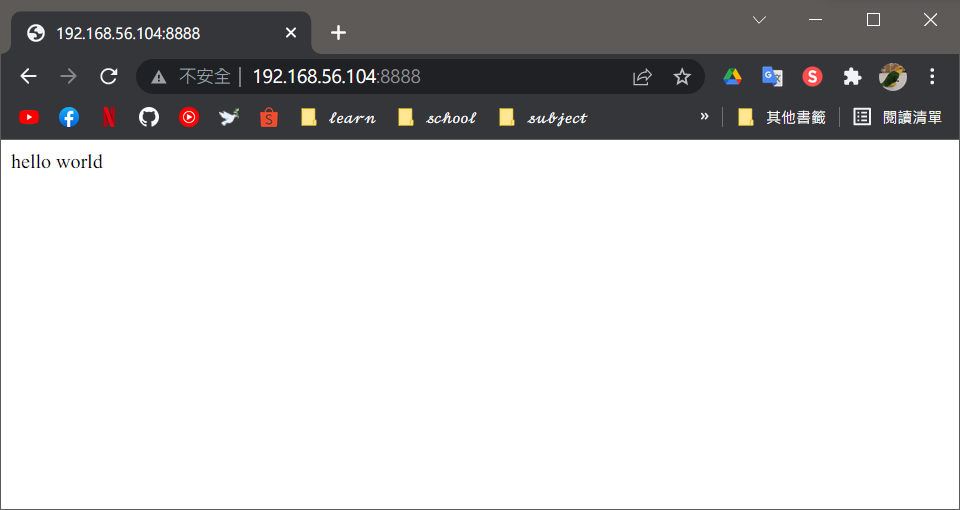
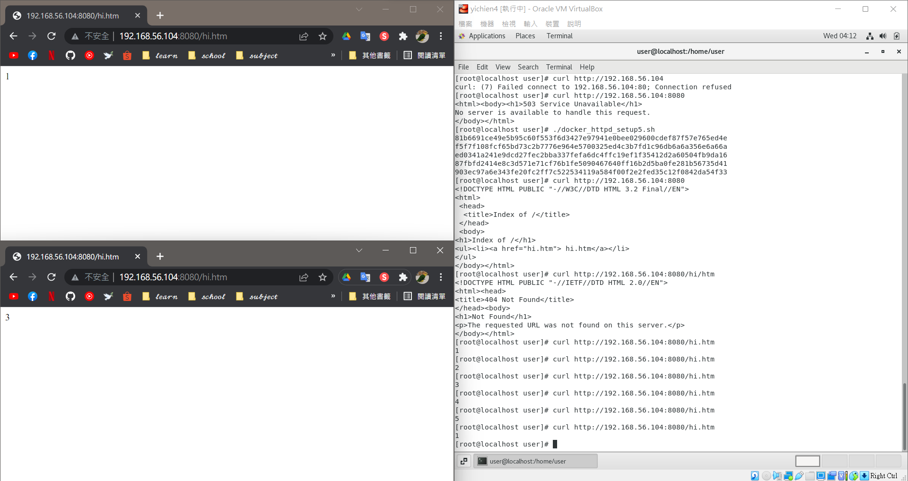
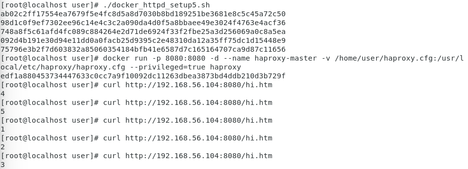

# 📝 Linux系統自動化運維第五週筆記20220316
# 📖 Docker 
### 👉 Docker 腳本運行
#### 📍 寫腳本 - gedit prepare_web.sh 
```
01 # cat prepare_web.sh 
    #!/usr/bin/bash

    for i in {1..5};
    do
      mkdir -p myweb$i
      cd myweb$i
      echo $i > hi.htm
      cd ..
    done
02 # chmod +x prepare.sh 
03 # ./prepare.sh 
```
#### 📍 寫腳本 - gedit docker_httpd_setup5.sh
```
04 # cat docker_httpd_setup5.sh
    #!/usr/bin/bash

    for i in {1..5};
    do

      portno=`expr 9000 + $i`
      docker run -d -p $portno:80 -v /home/user/myweb$i:/usr/local/apache2/htdocs httpd
    done 
05 # chmod +x docker_httpd_setup5.sh 
06 # ./docker_httpd_setup5.sh 
    e33b34412371193918a82842e4780cea16763f911102ec96e012b5dc7679f70c
    95afe4300b8fdb5ec666da94b8f5721bb833dccd3123ac8497f817f44a44aa68
    1ef645185dfe252b4b31475e57e0f34af4bcc454b0069ebe59b0c27be652ea6e
    324406ffa0c9c53eeb3ff8e256f8953556e0068cbd4adbfbda0c8e5515feebf0
    e0d1ff4c4cd4d7fe113ab9280143a9c9da50d9e0bb937ed6c87760bf46b980a0
```
* 成果

### 👉 Docker 建構鏡像文本 - gedit Dockerfile
```
07 # cat Dockerfile
    FROM centos:centos7
    RUN yum -y install httpd
    EXPOSE 80
    ADD index.html /var/www/html
08 # echo "hello world" > index.html
09 # docker build -t myhttpd:1.0 .
    Sending build context to Docker daemon  4.596MB
    Step 1/4 : FROM centos:centos7
    ---> eeb6ee3f44bd
    Step 2/4 : RUN yum -y install httpd
    ---> Using cache
    ---> 2f4a75eb4984
    Step 3/4 : EXPOSE 80
    ---> Using cache
    ---> e6b536cf3340
    Step 4/4 : ADD index.html /var/www/html
    ---> Using cache
    ---> a1fd32d58e79
    Successfully built a1fd32d58e79
    Successfully tagged myhttpd:1.0
```
#### 📍 開啟容器測試
```
10 # docker run -d -p 8888:80 myhttpd:1.0 /usr/sbin/apachectl -DFOREGROUND
    16bbe18dad8a65fca83f835904c9d9a01489ceedce9e420b784cb7afa65cbbde
```
* 成果

# 📖 Docker 運行 Haproxy
#### 📍 創建 Haproxy - touch haproxy.cfg
```
11 # cat haproxy.cfg
    defaults
      mode http
      timeout client 10s
      timeout connect 5s
      timeout server 10s
      timeout http-request 10s

    frontend myfrontend
      bind 0.0.0.0:8080
      default_backend myservers

    backend myservers
      balance roundrobin
      server server1 192.168.56.104:9001
      server server2 192.168.56.104:9002
      server server3 192.168.56.104:9003
      server server4 192.168.56.104:9004
      server server5 192.168.56.104:9005
```
* 成果

#### 📍 執行 haproxy.cfg
```
12 # docker run -p 8080:8080 -d --name haproxy-master -v /home/user/haproxy.cfg:/usr/local/etc/haproxy/haproxy.cfg --privileged=true haproxy
    acdc64e7e0f08bd2c9650f225c3163f17382889550bb975145a5ba3546028038
13 # docker ps -a
    CONTAINER ID   IMAGE     COMMAND                  CREATED          STATUS          PORTS                                       NAMES
    acdc64e7e0f0   haproxy   "docker-entrypoint.s…"   17 seconds ago   Up 16 seconds   0.0.0.0:8080->8080/tcp, :::8080->8080/tcp   haproxy-master
14 # docker logs acd
    [NOTICE]   (1) : New worker (8) forked
    [NOTICE]   (1) : Loading success.
```
* 成果


### 👉 Pull Docker Images
```
15 # docker pull faucet/python3
    Using default tag: latest
    latest: Pulling from faucet/python3
    59bf1c3509f3: Pull complete 
    309cc9d30407: Pull complete 
    0b8d4d1796c6: Pull complete 
    9de4cabd6442: Pull complete 
    Digest: sha256:2deeb32c07d6eee2ae0d57a643f2ec11f392804076920af02c17163c945728ce
    Status: Downloaded newer image for faucet/python3:latest
    docker.io/faucet/python3:latest
16 # docker run -it -v /home/user:/mydata faucet/python3 bash
    Starting with UID=0 GID=0
    bash-5.1# cd mydata/
    bash-5.1# python3 test.py 
    hello world
```

# 📖 `awk` 指令用法
### 👉 使用範例
```
17 $ ifconfig enp0s8 | grep netmask
    inet 192.168.56.104  netmask 255.255.255.0  broadcast 192.168.56.255
18 $ ifconfig enp0s8 | grep netmask | awk '{print $0}'
    inet 192.168.56.104  netmask 255.255.255.0  broadcast 192.168.56.255
19 $ ifconfig enp0s8 | grep netmask | awk '{print $2}'
    192.168.56.104
20 $ ifconfig enp0s8 | awk '/netmask/ {print $2}'
    192.168.56.104
21 $ ifconfig enp0s8 | awk 'NR==2 {print $2}'
    192.168.56.104
22 $ ifconfig enp0s8 | head -n 2 | tail -n 1
    inet 192.168.56.104  netmask 255.255.255.0  broadcast 192.168.56.255
```
### 👉 awk 程式模式
```
23 # cat file 
    11 dywang 81 12 A
    152 linda 90 58 C
    33 peter 72 95 C
    4 rita 65 34 E
    58 cora 5 85 D
24 # awk 'BEGIN{sum=0} {sum+=$3;} END {printf("SUM:%d\n",sum)}' file
    SUM:313
```
#### 📍 寫程式(總分&平均) - gedit process.awk
```
25 # cat process.awk
    BEGIN{
      sum=0;
      i=0;
    }
    {
      sum+=$3;
      i++;
    }
    END{
      printf("SUM = %d\n",sum);
      printf("AVG = %.2f\n",sum/i);
    }
26 # awk -f process.awk file
    SUM = 313
    AVG = 62.60
```
#### 📍 寫程式(最高分者) - gedit process_max.awk
```
27 # cat process_max.awk
    BEGIN{
      sum=0;
      max_name="";
    }
    {
      tmp_sum=$3+$4;
      #printf("tmp_sum=%d sum=%d\n",tmp_sum,sum);
      if(tmp_sum > sum){
        sum=tmp_sum;
        max_name=$2;
      }
    }
    END{
      printf("MAX = %s\n",max_name);
      printf("SCORE = %d\n",sum);
    }
28 # gawk -f process_max.awk file
    MAX = peter
    SCORE = 167
```
#### 📍 去掉符號 `-F`
```
29 # cat file 
    11,dywang,81,12,A
    152,linda,90,58,C
    33,peter,72,95,C
    4,rita,65,34,E
    58,cora,5,85,D
30 # awk -F, '{print $2}' file
    dywang
    linda
    peter
    rita
    cora
```
## 📖 補充資料
* [沒一村 - awk 好用用法整理](https://noootown.com/awk-useful-usage/)
* [awk 範例一](https://dywang.csie.cyut.edu.tw/dywang/linuxProgram/node51.html)


🖊️ editor : yi-chien Liu