# 📝 Linux系統自動化運維第六週筆記20220323
# 📖 RSYNC (遠端同步)
參數 | 內容
--- | ---
-v | verbose 模式，輸出比較詳細的訊息
-r | 遞迴（recursive）備份所有子目錄下的目錄與檔案
-a | 封裝備份模式，相當於 -rlptgoD，遞迴備份所有子目錄下的目錄與檔案，保留連結檔、檔案的擁有者、群組、權限以及時間戳記
-z | 啟用壓縮
-h | 將數字以比較容易閱讀的格式輸出
### 👉 安裝 rsync
```
01 # yum install rsync
```
## 🔖 rsync 操作
### 👉 修改、新增本地端的檔案 & 目錄
* 這種用法對於檔案或目錄都適用
#### 📍 備份檔案
```
02 # rsync -avh a.txt /tmp
    sending incremental file list
    a.txt

    sent 94 bytes  received 35 bytes  258.00 bytes/sec
    total size is 3  speedup is 0.02
03 # cd /tmp
04 # ls | grep a.txt
    a.txt
05 # rsync -avh testdir/ /tmp
    sending incremental file list
    ./
    1.txt
    2.txt
    3.txt
    4.txt
    5.txt

    sent 591 bytes  received 209 bytes  1.60K bytes/sec
    total size is 0  speedup is 0.00
```
* 成果
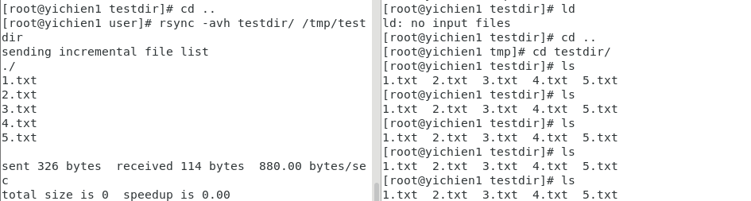
#### 📍 備份目錄
```
06 # rsync -avh testdir/ /tmp/testdir
    sending incremental file list
    ./
    a/
    a/b/
    a/b/c/

    sent 257 bytes  received 31 bytes  576.00 bytes/sec
    total size is 6  speedup is 0.02
```
* 成果
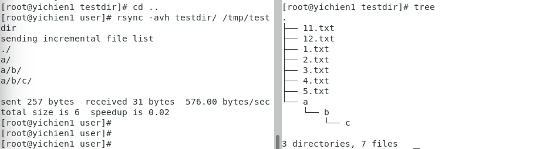
#### 📍 查看雜湊值(獨一無二)
```
07 # md5sum 1.txt
    d41d8cd98f00b204e9800998ecf8427e  1.txt
08 # echo "11" > 1.txt
09 # md5sum 1.txt
    166d77ac1b46a1ec38aa35ab7e628ab5  1.txt
```
### 👉 刪除本地端檔案 `rsync -avh --delete`
```
10 # rm -rf {13..15}.txt
11 # cd ..
12 # rsync -avh --delete testdir/ /tmp/testdir
    sending incremental file list
    deleting 15.txt
    deleting 14.txt
    deleting 13.txt
    ./

    sent 180 bytes  received 49 bytes  458.00 bytes/sec
    total size is 6  speedup is 0.03
```
### 👉 備份遠端檔案 & 目錄
```
13 # rsync -avzh testdir/ root@192.168.56.107:/tmp/backup
    sending incremental file list
    ./
    1.txt
    2.txt
    3.txt
    4.txt
    5.txt
    a/
    a/b/
    a/b/c/

    sent 417 bytes  received 130 bytes  121.56 bytes/sec
    total size is 6  speedup is 0.01
```
* 成果
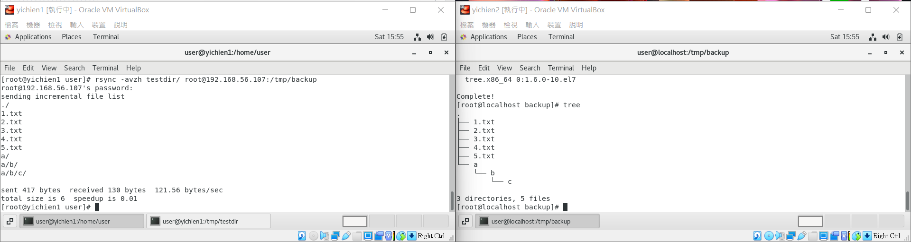
#### 📍 限制網路頻寬
```
14 # rsync -avzh --bwlimit=100K testdir/ root@192.168.56.107:/tmp/backup
    sending incremental file list
    ./
    13.txt

    sent 317 bytes  received 41 bytes  716.00 bytes/sec
    total size is 6  speedup is 0.02
```
* 成果
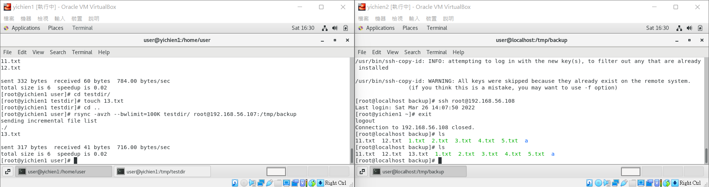
#### 📍 自訂 SSH 連接埠
```
15 # rsync -avzh -e "ssh -p 22" testdir/ root@192.168.56.107:/tmp/backup
    sending incremental file list
    ./
    14.txt

    sent 338 bytes  received 41 bytes  758.00 bytes/sec
    total size is 6  speedup is 0.02
```
* 成果
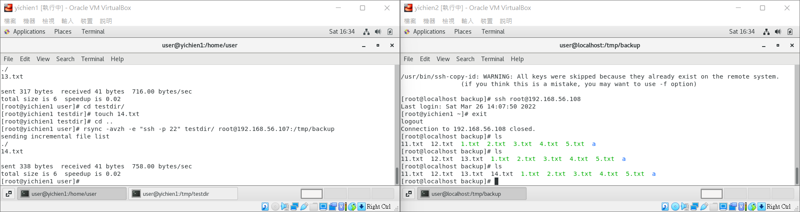
#### 📍 顯示傳輸進度
```
16 # rsync -avzh --progress testdir/ root@192.168.56.107:/tmp/backup
    sending incremental file list
    ./
    15.txt
                0 100%    0.00kB/s    0:00:00 (xfr#1, to-chk=7/14)

    sent 357 bytes  received 41 bytes  796.00 bytes/sec
    total size is 6  speedup is 0.02
```
* 成果
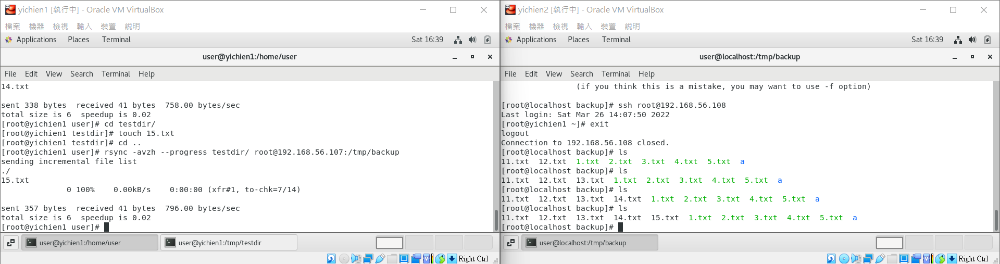
#### 📍 同步刪除檔案
```
17 # rsync -avzh --delete testdir/ root@192.168.56.107:/tmp/backup
    sending incremental file list
    deleting 15.txt
    deleting 14.txt
    deleting 13.txt
    deleting 12.txt
    deleting 11.txt
    ./

    sent 214 bytes  received 72 bytes  190.67 bytes/sec
    total size is 6  speedup is 0.02
```
* 成果
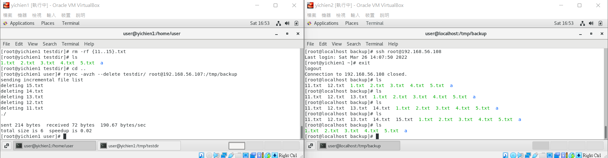

#### 📍 備份特定檔案
```
18 # rsync -avzh --exclude '*.txt' testdir/ root@192.168.56.107:/tmp/backup
    sending incremental file list
    ./
    test/

    sent 149 bytes  received 26 bytes  350.00 bytes/sec
    total size is 0  speedup is 0.00
```
* 成果
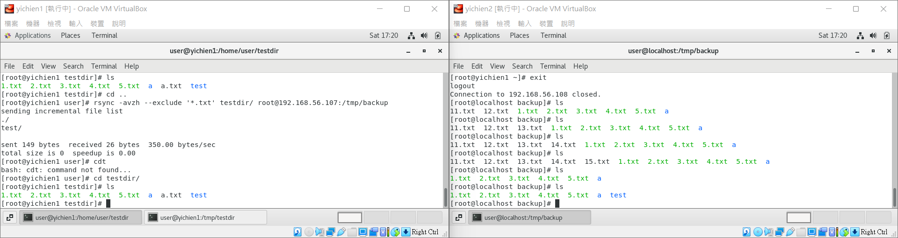
#### 📍 限定備份檔案大小
```
19 # rsync -avzh --max-size=1M testdir/ root@192.168.56.107:/tmp/backup
    sending incremental file list
    size.txt

    sent 321 bytes  received 39 bytes  720.00 bytes/sec
    total size is 18  speedup is 0.05
```
* 成果

#### 📍 自動刪除來源檔案
* 在備份檔案之後，自動將來源檔案刪除（也就是相當於 mv 的效果）
```
20 # rsync -avzh --remove-source-files testdir/ root@192.168.56.107:/tmp/backup
    sending incremental file list
    ./
    11.txt
    12.txt
    13.txt

    sent 431 bytes  received 152 bytes  1.17K bytes/sec
    total size is 18  speedup is 0.03
```
* 成果
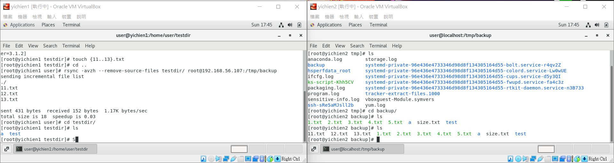
#### 📍 測試 rsync 參數
* 如果不確定自己的 `rsync` 參數是否正確，在實際執行之前可以加上 `--dry-run` 來測試一下，加上這個參數之後會輸出正常的訊息，不過並不會更動到任何的檔案
```
21 # rsync -avzh --dry-run --remove-source-files testdir/ root@192.168.56.107:/tmp/backup
    sending incremental file list
    ./
    15.txt
    16.txt
    17.txt
    18.txt
    19.txt
    20.txt

    sent 278 bytes  received 41 bytes  638.00 bytes/sec
    total size is 0  speedup is 0.00 (DRY RUN)
```
* 成果
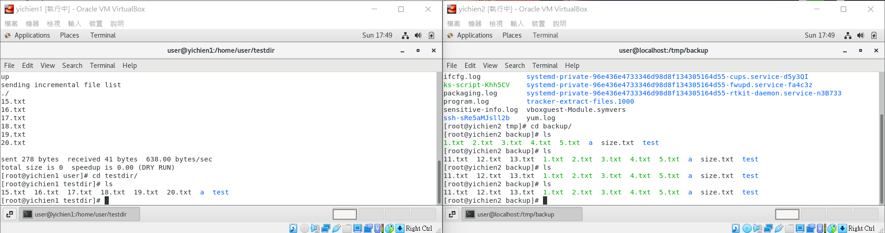
#### 📍 顯示檔案變動資訊
```
22 # rsync -avzhi --existing testdir/ root@192.168.56.107:/tmp/backup
    sending incremental file list
    <f.st...... 3.txt

    sent 319 bytes  received 45 bytes  242.67 bytes/sec
    total size is 4  speedup is 0.01
```
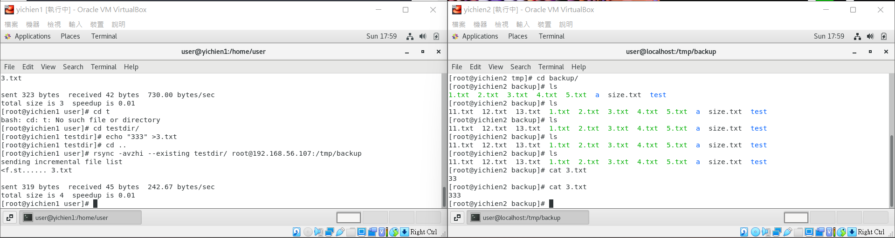
## 🔖 標示字串的欄位
參數 | 內容
--- | ---
Y | < 代表檔案傳送至遠端，> 代表檔案傳送至本地端，c 代表本地端變動（建立目錄等），h 代表硬式連結（hard link），. 代表沒有變動，* 代表其餘欄位有包含訊息（例如 deleting）。
X | 檔案類型，f 為一般檔案，d 為目錄，L 為連結檔，D 為設備檔（device），S 為特殊檔案（如 sockets 或 fifo）。
c | 代表檔案內容有變動。
s | 代表檔案大小有變動。
t | 代表檔案時間戳記有變動。
p | 代表檔案權限有變動。
o | 代表檔案擁有者有變動。
g | 代表檔案群組有變動。
u | 保留欄位。
a | 代表檔案 ACL 資訊有變動。
x | 代表檔案擴充屬性（extended attribute）有變動。

# 📖 安裝 Rsyncd 遠端檔案同步伺服器
* 兩台先時間同步
```
23 # ntpdate watch.stdtime.gov.tw
    28 Mar 14:38:34 ntpdate[6330]: step time server 118.163.81.63 offset 1.591184 sec
```
### 👉 啟動伺服器
```
24 # systemctl enable rsyncd
    Created symlink from /etc/systemd/system/multi-user.target.wants/rsyncd.service to /usr/lib/systemd/system/rsyncd.service.
25 # systemctl start rsyncd
```
```
26 # cat /var/run/rsyncd.pid
    12006
27 # cat /var/log/rsyncd.log
    2022/03/28 14:41:24 [12006] Unknown Parameter encountered: "secrets"
    2022/03/28 14:41:24 [12006] IGNORING unknown parameter "secrets"
    2022/03/28 14:41:24 [12006] rsyncd version 3.1.2 starting, listening on port 873
```
### 👉 SERVER端
```
28 # gedit /etc/rsyncd.conf
    uid=root
    gid=root
    pid file = /var/run/rsyncd.pid
    log file = /var/log/rsyncd.log
    secrets file = /etc/rsyncd.passwd 

    [mod1]
    path = /backup1
    read only = no
    auth users = rsync_vuser
29 # gedit /etc/rsyncd.passwd
    rsync_vuser:123456
```
#### 📍 開啟權限 & 啟動伺服器
```
30 # chmod 600 /etc/rsyncd.passwd
31 # chmod 600 /etc/rsyncd.conf
32 # systemctl start rsyncd
```
### 👉 CLIENT端
```
33 # gedit /etc/rsync_vuser.passwd
    123456
34 # chmod 600 /etc/rsync_vuser.passwd
35 # rsync -avzu --progress --password-file=/etc/rsync_vuser.passwd /tmp/test.txt rsync_vuser@192.168.56.108::mod1
    sending incremental file list
    test.txt
                6 100%    0.00kB/s    0:00:00 (xfr#1, to-chk=0/1)

    sent 97 bytes  received 35 bytes  264.00 bytes/sec
    total size is 6  speedup is 0.05
```
* 成果
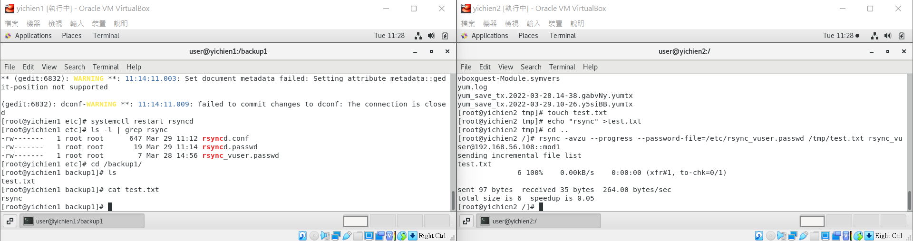

# 📖 RSYNC + INOTIFY同步備份
### 👉 SERVER端
#### 📍 编辑rysnc配置文件
```
36 # gedit /etc/rsyncd.conf
    uid = rsync
    gid = rsync
    use chroot = no
    max connections = 200
    timeout = 300
    pid file = /var/run/rsyncd.pid
    lock file = /var/run/rsync.lock
    log file = /var/log/rsyncd.log
    secrets file = /etc/rsync.passwd
    ignore errors
    read only = false
    list = false
    hosts allow = 192.168.56.0/24
    auth users = rsync_backup

    [backup]
        comment = "backup dirtory"
        path = /home/user/backup
        auth users = rsync_backup
```
#### 📍 創建用戶
```
37 # useradd -s /sbin/nologin -M rsync
```
#### 📍 創建同步目錄
```
38 # mkdir /home/user/backup
39 # chown -R rsync.rsync backup/
```
#### 📍 創建用戶 & 更改密碼文件權限
```
40 # touch /etc/rsync.passwd
41 # echo "rsync_backup:backup" > /etc/rsync.passwd
42 # chmod 600 /etc/rsync.passwd
```
#### 📍 啟動伺服器
```
43 # systemctl restart rsyncd
```
#### 📍 查看進程
```
44 # ps aux | grep rsync
    root      8080  0.0  0.1 114848  1184 ?        Ss   11:31   0:00 /usr/bin/rsync --daemon --no-detach
    root      8103  0.0  0.0 112812   980 pts/0    S+   11:31   0:00 grep --color=auto rsync
45 # netstat -lntp | grep rsync
    tcp        0      0 0.0.0.0:873             0.0.0.0:*               LISTEN      8080/rsync          
    tcp6       0      0 :::873                  :::*                    LISTEN      8080/rsync  
```
### 👉 CLIENT端
#### 📍 檢查是否安裝 rsync & inotify
```
46 # rpm -qa | grep rsync
47 # rpm -qa | grep inotify-tools
```
#### 📍 創建安全認證文件 & 更改密碼文件權限
```
48 # touch /etc/rsync.passwd
49 # echo "backup" > /etc/rsync.passwd
50 # chmod 600 /etc/rsync.passwd
```
#### 📍 推送文件測試
```
50 # rsync -avzP  /home/user/testdir rsync_backup@192.168.56.107::backup --password-file=/etc/rsync.passwd
```
#### 📍 寫腳本 - gedit inotify_backup.sh 
```
51 # gedit inotify_backup.sh 
    #!/bin/bash
    Path=/home/user/testdir/
    backup_Server=192.168.56.107

    /usr/bin/inotifywait -mrq --format '%w%f' -e create,close_write,delete $Path  | while read line  
    do
        if [ -f $line ];then
            rsync -az $line --delete rsync_backup@$backup_Server::backup --password-file=/etc/rsync.passwd
        else
            cd $Path &&\
            rsync -az ./ --delete rsync_backup@$backup_Server::backup --password-file=/etc/rsync.passwd
        fi
    done
```
#### 📍 更改權限 & 後臺運行腳本
```
52 # chmod +x /home/user/inotify_backup.sh 
52 # sh /home/user/inotify_backup.sh 
53 # touch test.txt
```
* 成果
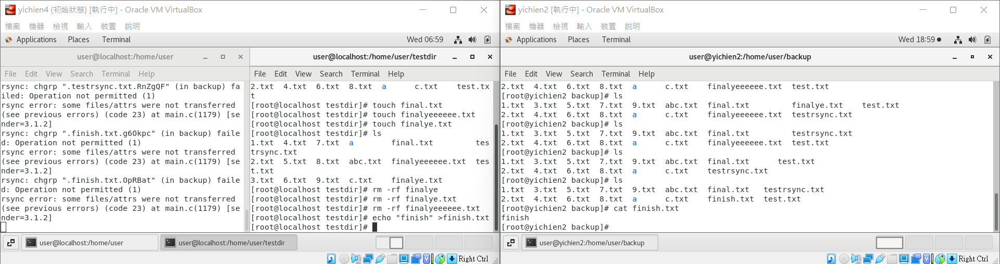

## 📖 補充資料
* [CentOS 7.6 上安裝 Rsyncd 遠端檔案同步伺服器](https://blog.tomy168.com/2019/01/centos-76x64-rsync-daemon.html)
* [Linux 使用 rsync 遠端檔案同步與備份工具教學與範例](https://blog.gtwang.org/linux/rsync-local-remote-file-synchronization-commands/)
* [Linux 运维：rsync+inotify实时同步](https://segmentfault.com/a/1190000018096553)


🖊️ editor : yi-chien Liu